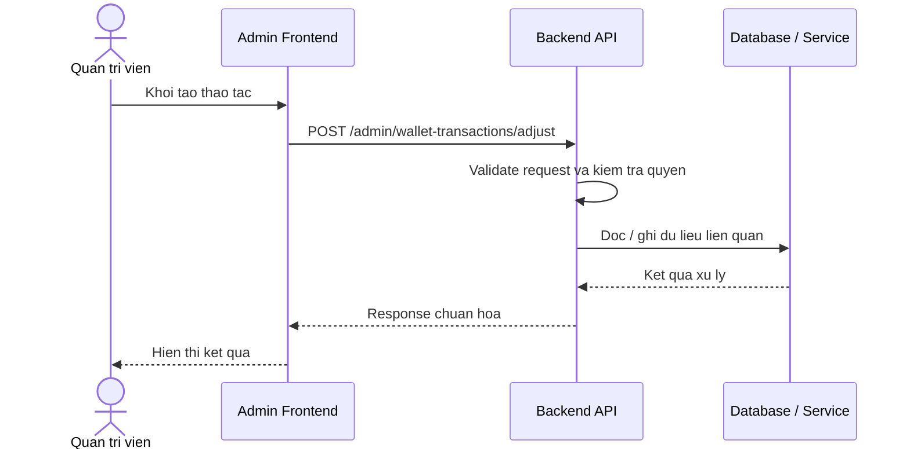

# Software Requirement Specification (SRS)
## Chuc nang: Quan tri dieu chinh so du vi

### Mermaid Sequence Diagram

**Ma chuc nang:** ADMIN-WALLET-TRANSACTION-ADJUST-01  
**Trang thai:** Draft / Review  
**Nguoi soan thao:** Nhu Trung Hai  
**Vai tro:** Technical Writer / Developer

---

### 1. Mo ta tong quan (Description)
Chuc nang cho phep admin cong / tru so du vi thu cong va ghi nhan mot giao dich dieu chinh minh bach. API hien tai duoc trien khai tai `POST /admin/wallet-transactions/adjust`.

### 2. Luong nghiep vu (User Workflow)
| Buoc | Hanh dong nguoi dung | Phan hoi he thong |
| :--- | :--- | :--- |
| 1 | Nguoi dung / quan tri vien mo chuc nang tuong ung | Frontend chuan bi du lieu va goi API. |
| 2 | Frontend gui request den backend | Backend kiem tra du lieu dau vao, token, quyen va ngu canh nghiep vu. |
| 3 | Backend xu ly nghiep vu | He thong doc / ghi du lieu tai MongoDB hoac dich vu phu tro. |
| 4 | Hoan tat | Backend tra response dang `status`, `message`, `data` de frontend cap nhat giao dien. |

### 3. Yeu cau du lieu (Data Requirements)
#### 3.1. Du lieu dau vao (Input Fields)
* Admin session hop le.
* Body theo validator `adjustAdminWalletTransactionValidator` gom user, so tien, loai dieu chinh, ly do.

#### 3.2. Du lieu dau ra (Response Data)
* Thong tin giao dich dieu chinh vua tao.
* So du vi sau dieu chinh.

#### 3.3. Du lieu luu tru / truy xuat
* Collection `wallets` de cap nhat so du.
* Collection `wallet_transactions` de ghi log dieu chinh.
* Collection `admin_audit_logs` de luu dau vet thao tac neu he thong bat audit.

### 4. Rang buoc ky thuat & bao mat (Technical Constraints)
* Chi admin moi duoc thao tac.
* Dieu chinh vi phai ghi log day du de truy vet.
* Khong duoc de so du am neu chinh sach khong cho phep.

### 5. Truong hop ngoai le & xu ly loi (Edge Cases)
* **Truong hop:** User khong ton tai.  
  * **Xu ly:** Tra `404`.
* **Truong hop:** So tien dieu chinh khong hop le hoac lam so du am.  
  * **Xu ly:** Tra loi nghiep vu.
* **Truong hop:** Ghi vi thanh cong nhung ghi log giao dich that bai.  
  * **Xu ly:** Can rollback hoac bao loi he thong.

### 6. Giao dien (UI/UX)
* Form dieu chinh vi can bat buoc nhap ly do.
* Nen hien thi canh bao ro rang vi day la thao tac nhay cam.

---
