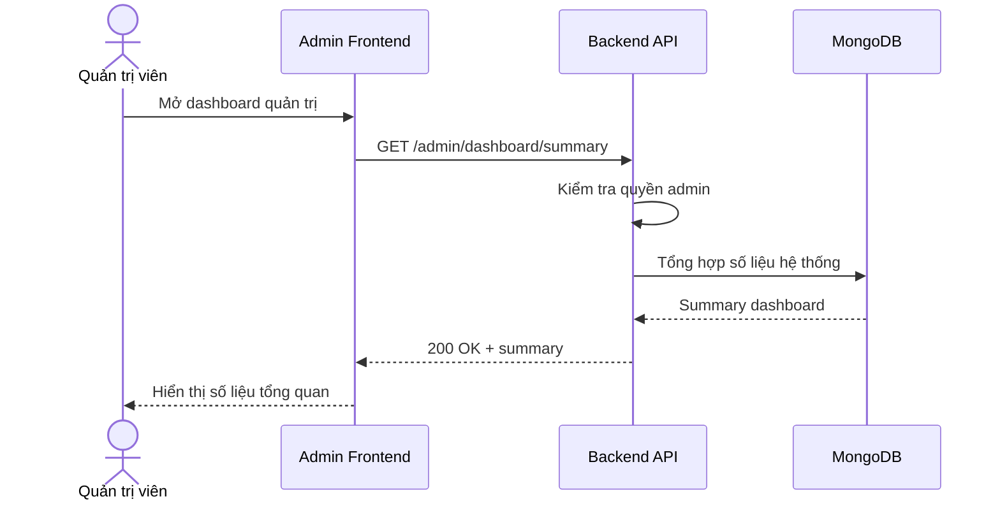

# Software Requirement Specification (SRS)
## Chức năng: Xem tổng quan dashboard quản trị (Admin Dashboard Summary)

### Mermaid Sequence Diagram

**Mã chức năng:** ADMIN-DASHBOARD-01  
**Trạng thái:** Draft / Review  
**Người soạn thảo:** Nhữ Trung Hải  
**Vai trò:** Technical Writer / Developer

---

### 1. Mô tả tổng quan (Description)
Chức năng tổng quan dashboard quản trị cho phép admin xem nhanh số liệu người dùng, công ty, job và các chỉ số vận hành hệ thống. API được triển khai tại `GET /admin/dashboard/summary`.

### 2. Luồng nghiệp vụ (User Workflow)
| Bước | Hành động người dùng | Phản hồi hệ thống |
| :--- | :--- | :--- |
| 1 | Admin mở dashboard | Frontend gọi API summary. |
| 2 | Backend xác thực quyền | Chỉ cho phép `ADMIN`. |
| 3 | Backend tổng hợp dữ liệu | Gọi dashboard service để lấy summary. |
| 4 | Hoàn tất | Trả dữ liệu tổng quan hệ thống. |

### 3. Yêu cầu dữ liệu (Data Requirements)
#### 3.1. Dữ liệu đầu vào (Input Fields)
* Admin session/cookie hợp lệ.

#### 3.2. Dữ liệu đầu ra (Response Data)
* `status`
* `data.summary`

#### 3.3. Dữ liệu lưu trữ / truy xuất
* Các collection hệ thống phục vụ thống kê

### 4. Ràng buộc kỹ thuật & bảo mật (Technical Constraints)
* Chỉ admin mới truy cập được.

### 5. Trường hợp ngoại lệ & xử lý lỗi (Edge Cases)
* **Trường hợp:** Lỗi khi tổng hợp dữ liệu.  
  * **Xử lý:** Trả `500 Internal Server Error`.

### 6. Giao diện (UI/UX)
* Dashboard nên hiển thị card tổng quan và biểu đồ nếu cần.

---
