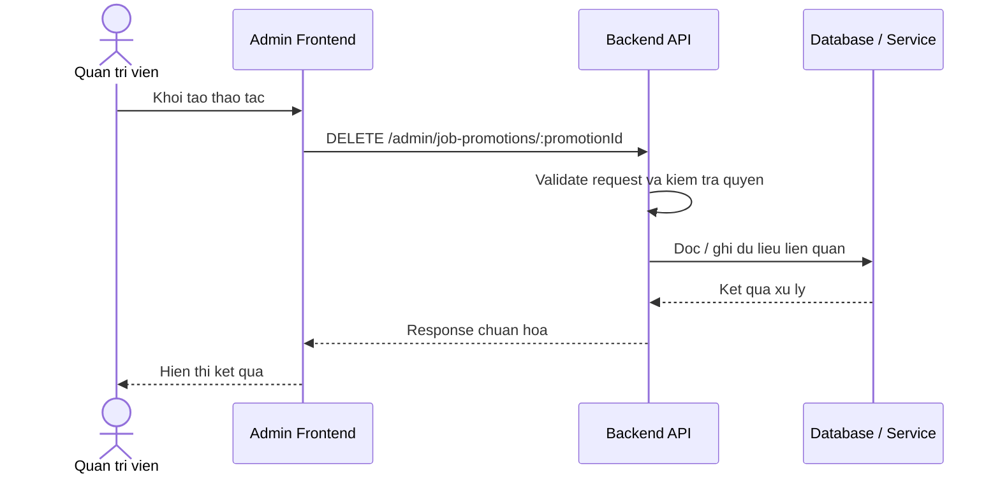

# Software Requirement Specification (SRS)
## Chuc nang: Quan tri xoa quang ba viec lam

### Mermaid Sequence Diagram

**Ma chuc nang:** ADMIN-JOB-PROMOTION-DELETE-01  
**Trang thai:** Draft / Review  
**Nguoi soan thao:** Nhu Trung Hai  
**Vai tro:** Technical Writer / Developer

---

### 1. Mo ta tong quan (Description)
Chuc nang cho phep admin xoa mot promotion khong con su dung hoac da cau hinh sai. API hien tai duoc trien khai tai `DELETE /admin/job-promotions/:promotionId`.

### 2. Luong nghiep vu (User Workflow)
| Buoc | Hanh dong nguoi dung | Phan hoi he thong |
| :--- | :--- | :--- |
| 1 | Nguoi dung / quan tri vien mo chuc nang tuong ung | Frontend chuan bi du lieu va goi API. |
| 2 | Frontend gui request den backend | Backend kiem tra du lieu dau vao, token, quyen va ngu canh nghiep vu. |
| 3 | Backend xu ly nghiep vu | He thong doc / ghi du lieu tai MongoDB hoac dich vu phu tro. |
| 4 | Hoan tat | Backend tra response dang `status`, `message`, `data` de frontend cap nhat giao dien. |

### 3. Yeu cau du lieu (Data Requirements)
#### 3.1. Du lieu dau vao (Input Fields)
* Admin session hop le.
* Path param `promotionId` hop le.

#### 3.2. Du lieu dau ra (Response Data)
* Thong bao xoa thanh cong.

#### 3.3. Du lieu luu tru / truy xuat
* Collection `job_promotions`.

### 4. Rang buoc ky thuat & bao mat (Technical Constraints)
* Chi admin moi duoc xoa.
* Can kiem tra rule nghiep vu truoc khi xoa promotion dang hoat dong.

### 5. Truong hop ngoai le & xu ly loi (Edge Cases)
* **Truong hop:** Promotion khong ton tai.  
  * **Xu ly:** Tra `404`.
* **Truong hop:** Promotion dang active khong duoc xoa cung.  
  * **Xu ly:** Tra loi nghiep vu.

### 6. Giao dien (UI/UX)
* Hanh dong xoa phai co xac nhan.
* Sau khi xoa can loai promotion khoi danh sach ngay.

---
