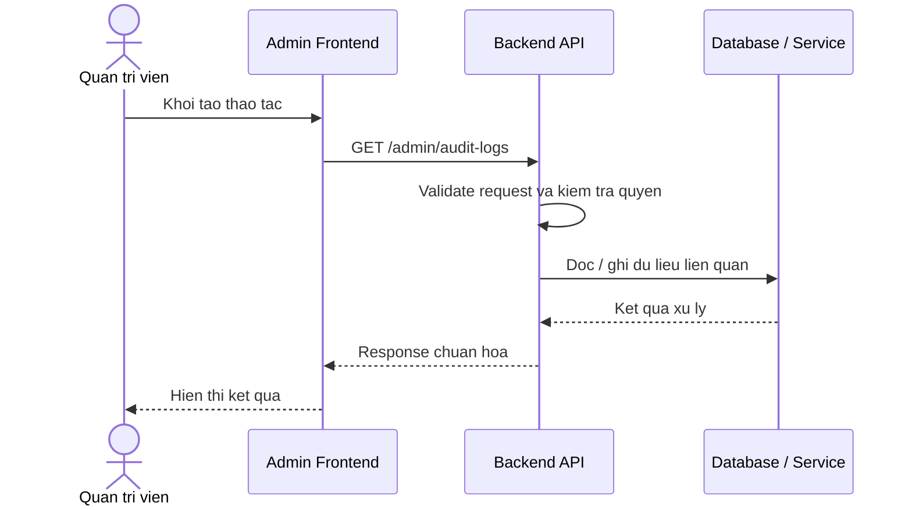

# Software Requirement Specification (SRS)
## Chuc nang: Quan tri xem nhat ky thao tac he thong

### Mermaid Sequence Diagram

**Ma chuc nang:** ADMIN-AUDIT-LOG-LIST-01  
**Trang thai:** Draft / Review  
**Nguoi soan thao:** Nhu Trung Hai  
**Vai tro:** Technical Writer / Developer

---

### 1. Mo ta tong quan (Description)
Chuc nang cho phep admin theo doi audit log de truy vet cac thay doi quan trong tren he thong. API hien tai duoc trien khai tai `GET /admin/audit-logs`.

### 2. Luong nghiep vu (User Workflow)
| Buoc | Hanh dong nguoi dung | Phan hoi he thong |
| :--- | :--- | :--- |
| 1 | Nguoi dung / quan tri vien mo chuc nang tuong ung | Frontend chuan bi du lieu va goi API. |
| 2 | Frontend gui request den backend | Backend kiem tra du lieu dau vao, token, quyen va ngu canh nghiep vu. |
| 3 | Backend xu ly nghiep vu | He thong doc / ghi du lieu tai MongoDB hoac dich vu phu tro. |
| 4 | Hoan tat | Backend tra response dang `status`, `message`, `data` de frontend cap nhat giao dien. |

### 3. Yeu cau du lieu (Data Requirements)
#### 3.1. Du lieu dau vao (Input Fields)
* Admin session hop le.
* Query loc / phan trang theo validator `getAdminAuditLogsValidator`.

#### 3.2. Du lieu dau ra (Response Data)
* Danh sach audit log, actor, action, thoi gian, metadata lien quan.

#### 3.3. Du lieu luu tru / truy xuat
* Collection `admin_audit_logs` hoac nguon log nghiep vu tuong duong.

### 4. Rang buoc ky thuat & bao mat (Technical Constraints)
* Chi admin moi xem duoc.
* Log can ho tro loc theo actor, action, thoi gian.

### 5. Truong hop ngoai le & xu ly loi (Edge Cases)
* **Truong hop:** Khong co log phu hop bo loc.  
  * **Xu ly:** Tra danh sach rong.
* **Truong hop:** Query khong hop le.  
  * **Xu ly:** Tra `422`.

### 6. Giao dien (UI/UX)
* Trang audit logs nen co bang filter theo thoi gian va hanh dong.
* Nen ho tro xem JSON metadata o tung ban ghi.

---
