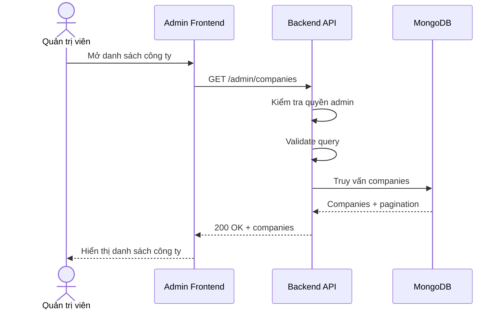

# Software Requirement Specification (SRS)
## Chức năng: Xem danh sách công ty quản trị (Admin Get Companies)

### Mermaid Sequence Diagram

**Mã chức năng:** ADMIN-COMPANIES-LIST-01  
**Trạng thái:** Draft / Review  
**Người soạn thảo:** Phạm Nguyễn Hưng  
**Vai trò:** Technical Writer / Developer

---

### 1. Mô tả tổng quan (Description)
Chức năng xem danh sách công ty cho phép admin quản lý các hồ sơ doanh nghiệp đã đăng ký trên hệ thống. API được triển khai tại `GET /admin/companies`.

### 2. Luồng nghiệp vụ (User Workflow)
| Bước | Hành động người dùng | Phản hồi hệ thống |
| :--- | :--- | :--- |
| 1 | Admin mở module companies | Frontend gọi API danh sách. |
| 2 | Backend kiểm tra quyền | Chỉ admin mới được xem. |
| 3 | Backend validate query | Kiểm tra bộ lọc và phân trang. |
| 4 | Hoàn tất | Trả danh sách companies. |

### 3. Yêu cầu dữ liệu (Data Requirements)
#### 3.1. Dữ liệu đầu vào (Input Fields)
* Query theo `getAdminCompaniesValidator`.

#### 3.2. Dữ liệu đầu ra (Response Data)
* `status`
* `data.companies`
* `data.pagination`

#### 3.3. Dữ liệu lưu trữ / truy xuất
* Collection `companies`

### 4. Ràng buộc kỹ thuật & bảo mật (Technical Constraints)
* Chỉ admin được truy cập.

### 5. Trường hợp ngoại lệ & xử lý lỗi (Edge Cases)
* **Trường hợp:** Query không hợp lệ.  
  * **Xử lý:** Trả `422 Unprocessable Entity`.

### 6. Giao diện (UI/UX)
* Nên hiển thị rõ trạng thái xác minh công ty.

---
