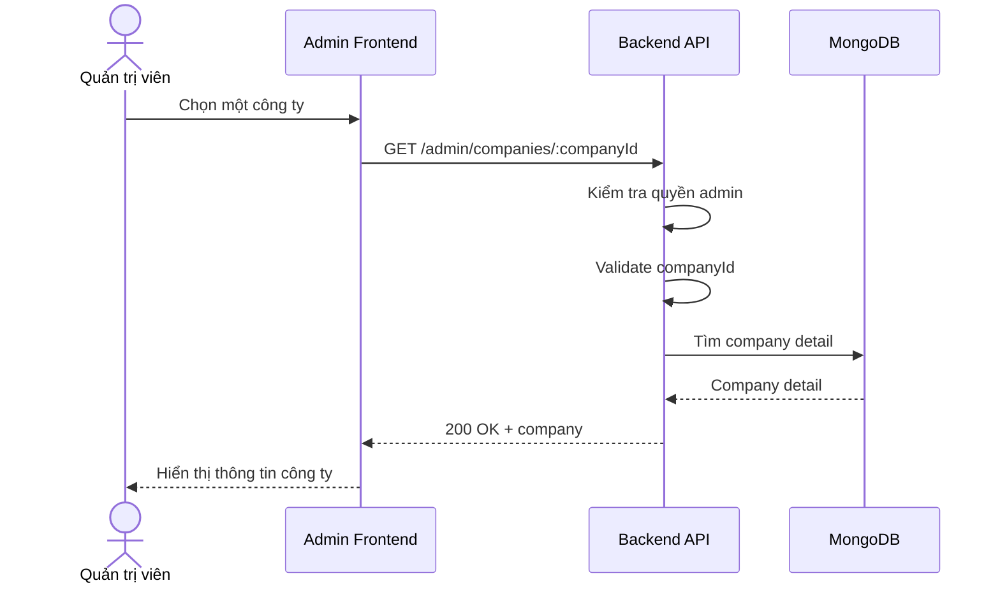

# Software Requirement Specification (SRS)
## Chức năng: Xem chi tiết công ty quản trị (Admin Get Company Detail)

### Mermaid Sequence Diagram

**Mã chức năng:** ADMIN-COMPANY-DETAIL-01  
**Trạng thái:** Draft / Review  
**Người soạn thảo:** Nguyễn Trọng An  
**Vai trò:** Technical Writer / Developer

---

### 1. Mô tả tổng quan (Description)
Chức năng xem chi tiết công ty cho phép admin mở thông tin đầy đủ của một hồ sơ doanh nghiệp. API hiện tại được triển khai tại `GET /admin/companies/:companyId`.

### 2. Luồng nghiệp vụ (User Workflow)
| Bước | Hành động người dùng | Phản hồi hệ thống |
| :--- | :--- | :--- |
| 1 | Admin chọn công ty | Frontend gọi API chi tiết company. |
| 2 | Backend validate `companyId` | Kiểm tra tham số. |
| 3 | Backend tải company | Trả dữ liệu chi tiết. |
| 4 | Hoàn tất | Frontend hiển thị company detail. |

### 3. Yêu cầu dữ liệu (Data Requirements)
#### 3.1. Dữ liệu đầu vào (Input Fields)
* **companyId:** Mongo ObjectId hợp lệ.

#### 3.2. Dữ liệu đầu ra (Response Data)
* `status`
* `data.company`

#### 3.3. Dữ liệu lưu trữ / truy xuất
* Collection `companies`

### 4. Ràng buộc kỹ thuật & bảo mật (Technical Constraints)
* Chỉ admin được truy cập.

### 5. Trường hợp ngoại lệ & xử lý lỗi (Edge Cases)
* **Trường hợp:** Company không tồn tại.  
  * **Xử lý:** Trả `404 Not Found`.

### 6. Giao diện (UI/UX)
* Màn chi tiết công ty nên có link sang danh sách jobs và applications của công ty đó.

---
