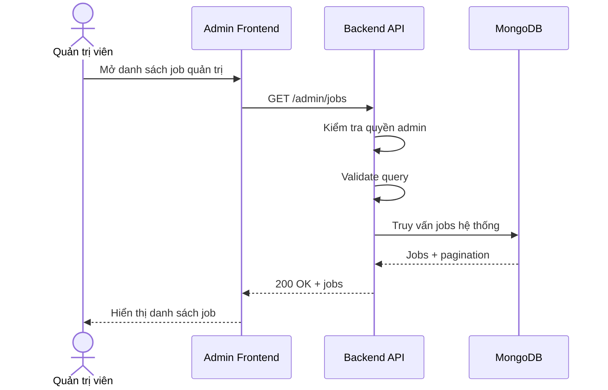

# Software Requirement Specification (SRS)
## Chức năng: Xem danh sách việc làm quản trị (Admin Get Jobs)

### Mermaid Sequence Diagram

**Mã chức năng:** ADMIN-JOBS-LIST-01  
**Trạng thái:** Draft / Review  
**Người soạn thảo:** Phạm Nguyễn Hưng  
**Vai trò:** Technical Writer / Developer

---

### 1. Mô tả tổng quan (Description)
Chức năng xem danh sách việc làm quản trị cho phép admin theo dõi toàn bộ tin tuyển dụng trong hệ thống. API được triển khai tại `GET /admin/jobs`.

### 2. Luồng nghiệp vụ (User Workflow)
| Bước | Hành động người dùng | Phản hồi hệ thống |
| :--- | :--- | :--- |
| 1 | Admin mở trang quản lý jobs | Frontend gọi API danh sách jobs. |
| 2 | Backend xác thực admin | Kiểm tra session và quyền truy cập. |
| 3 | Backend validate query | Kiểm tra bộ lọc và phân trang. |
| 4 | Hoàn tất | Trả danh sách jobs toàn hệ thống. |

### 3. Yêu cầu dữ liệu (Data Requirements)
#### 3.1. Dữ liệu đầu vào (Input Fields)
* Query theo `getAdminJobsValidator`.

#### 3.2. Dữ liệu đầu ra (Response Data)
* `status`
* `data.jobs`
* `data.pagination`

#### 3.3. Dữ liệu lưu trữ / truy xuất
* Collection `jobs`

### 4. Ràng buộc kỹ thuật & bảo mật (Technical Constraints)
* Chỉ admin mới được truy cập.

### 5. Trường hợp ngoại lệ & xử lý lỗi (Edge Cases)
* **Trường hợp:** Query không hợp lệ.  
  * **Xử lý:** Trả `422 Unprocessable Entity`.

### 6. Giao diện (UI/UX)
* Nên hỗ trợ tìm kiếm theo tiêu đề và trạng thái moderation.

---
