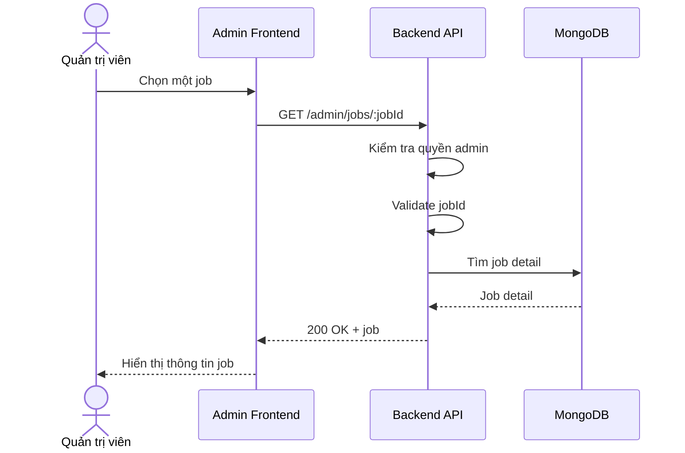

# Software Requirement Specification (SRS)
## Chức năng: Xem chi tiết việc làm quản trị (Admin Get Job Detail)

### Mermaid Sequence Diagram

**Mã chức năng:** ADMIN-JOB-DETAIL-01  
**Trạng thái:** Draft / Review  
**Người soạn thảo:** Nguyễn Trọng An  
**Vai trò:** Technical Writer / Developer

---

### 1. Mô tả tổng quan (Description)
Chức năng xem chi tiết job quản trị cho phép admin kiểm tra đầy đủ một tin tuyển dụng bất kỳ trong hệ thống. API được triển khai tại `GET /admin/jobs/:jobId`.

### 2. Luồng nghiệp vụ (User Workflow)
| Bước | Hành động người dùng | Phản hồi hệ thống |
| :--- | :--- | :--- |
| 1 | Admin mở chi tiết một job | Frontend gọi API chi tiết job. |
| 2 | Backend validate `jobId` | Kiểm tra tham số đầu vào. |
| 3 | Backend tải dữ liệu | Tìm job bằng middleware và trả chi tiết. |
| 4 | Hoàn tất | Hiển thị dữ liệu chi tiết tin tuyển dụng. |

### 3. Yêu cầu dữ liệu (Data Requirements)
#### 3.1. Dữ liệu đầu vào (Input Fields)
* **jobId:** Mongo ObjectId hợp lệ.

#### 3.2. Dữ liệu đầu ra (Response Data)
* `status`
* `data.job`

#### 3.3. Dữ liệu lưu trữ / truy xuất
* Collection `jobs`

### 4. Ràng buộc kỹ thuật & bảo mật (Technical Constraints)
* Chỉ admin mới được truy cập.

### 5. Trường hợp ngoại lệ & xử lý lỗi (Edge Cases)
* **Trường hợp:** Job không tồn tại.  
  * **Xử lý:** Trả `404 Not Found`.

### 6. Giao diện (UI/UX)
* Màn chi tiết admin nên hiển thị cả moderation status và blocked reason.

---
