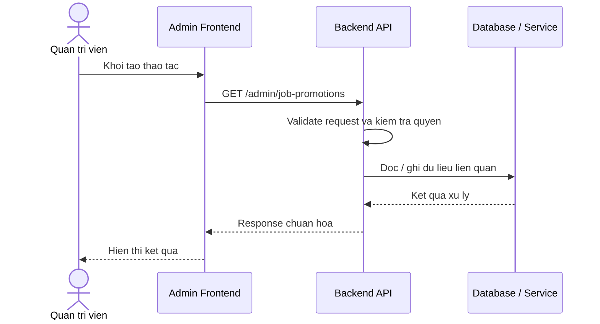

# Software Requirement Specification (SRS)
## Chuc nang: Quan tri xem danh sach cau hinh quang ba viec lam

### Mermaid Sequence Diagram

**Ma chuc nang:** ADMIN-JOB-PROMOTION-LIST-01  
**Trang thai:** Draft / Review  
**Nguoi soan thao:** Nhu Trung Hai  
**Vai tro:** Technical Writer / Developer

---

### 1. Mo ta tong quan (Description)
Chuc nang cho phep admin xem danh sach promotion dang ton tai trong he thong de van hanh va cau hinh hien thi. API hien tai duoc trien khai tai `GET /admin/job-promotions`.

### 2. Luong nghiep vu (User Workflow)
| Buoc | Hanh dong nguoi dung | Phan hoi he thong |
| :--- | :--- | :--- |
| 1 | Nguoi dung / quan tri vien mo chuc nang tuong ung | Frontend chuan bi du lieu va goi API. |
| 2 | Frontend gui request den backend | Backend kiem tra du lieu dau vao, token, quyen va ngu canh nghiep vu. |
| 3 | Backend xu ly nghiep vu | He thong doc / ghi du lieu tai MongoDB hoac dich vu phu tro. |
| 4 | Hoan tat | Backend tra response dang `status`, `message`, `data` de frontend cap nhat giao dien. |

### 3. Yeu cau du lieu (Data Requirements)
#### 3.1. Du lieu dau vao (Input Fields)
* Admin session hop le.
* Query loc / phan trang theo validator `getAdminJobPromotionsValidator`.

#### 3.2. Du lieu dau ra (Response Data)
* Danh sach promotion voi thong tin job, muc uu tien, trang thai, thoi gian hieu luc.

#### 3.3. Du lieu luu tru / truy xuat
* Collection `job_promotions`.

### 4. Rang buoc ky thuat & bao mat (Technical Constraints)
* Chi admin moi thao tac duoc.
* Danh sach nen ho tro loc theo trang thai va loai promotion.

### 5. Truong hop ngoai le & xu ly loi (Edge Cases)
* **Truong hop:** Chua co promotion nao.  
  * **Xu ly:** Tra danh sach rong.
* **Truong hop:** Query khong hop le.  
  * **Xu ly:** Tra `422`.

### 6. Giao dien (UI/UX)
* Trang admin promotion nen co bang va bo loc da tieu chi.
* Co the can thao tac mo chi tiet / chinh sua tu tung dong.

---
