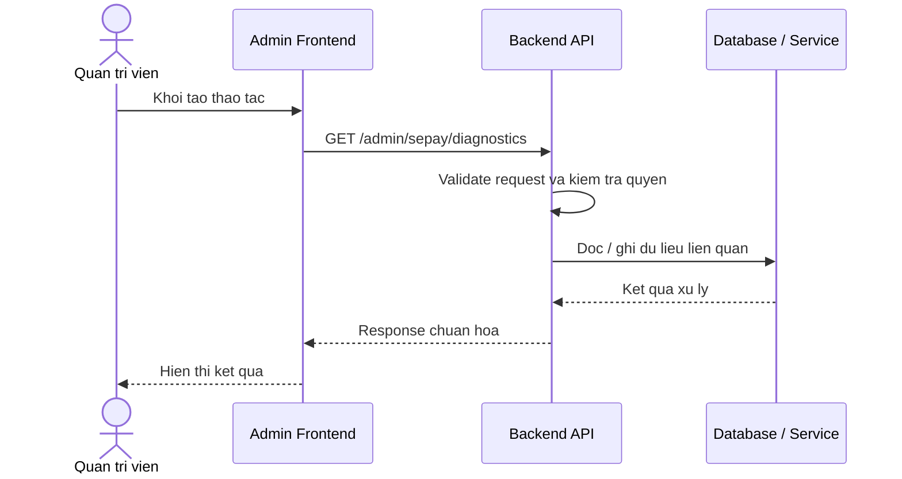

# Software Requirement Specification (SRS)
## Chuc nang: Quan tri xem chan doan SePay

### Mermaid Sequence Diagram

**Ma chuc nang:** ADMIN-SEPAY-DIAGNOSTICS-01  
**Trang thai:** Draft / Review  
**Nguoi soan thao:** Nhu Trung Hai  
**Vai tro:** Technical Writer / Developer

---

### 1. Mo ta tong quan (Description)
Chuc nang cung cap du lieu chan doan de admin xac minh tinh trang tich hop SePay va webhook lien quan. API hien tai duoc trien khai tai `GET /admin/sepay/diagnostics`.

### 2. Luong nghiep vu (User Workflow)
| Buoc | Hanh dong nguoi dung | Phan hoi he thong |
| :--- | :--- | :--- |
| 1 | Nguoi dung / quan tri vien mo chuc nang tuong ung | Frontend chuan bi du lieu va goi API. |
| 2 | Frontend gui request den backend | Backend kiem tra du lieu dau vao, token, quyen va ngu canh nghiep vu. |
| 3 | Backend xu ly nghiep vu | He thong doc / ghi du lieu tai MongoDB hoac dich vu phu tro. |
| 4 | Hoan tat | Backend tra response dang `status`, `message`, `data` de frontend cap nhat giao dien. |

### 3. Yeu cau du lieu (Data Requirements)
#### 3.1. Du lieu dau vao (Input Fields)
* Admin session hop le.
* Query theo validator `getAdminSePayDiagnosticsValidator` neu co.

#### 3.2. Du lieu dau ra (Response Data)
* Thong tin health, cau hinh quan trong da mask va cac tin hieu chan doan can thiet.

#### 3.3. Du lieu luu tru / truy xuat
* System settings SePay.
* Du lieu van hanh hoac log chan doan lien quan.

### 4. Rang buoc ky thuat & bao mat (Technical Constraints)
* Chi admin moi truy cap duoc.
* Khong duoc de lo secret that trong du lieu diagnostics.

### 5. Truong hop ngoai le & xu ly loi (Edge Cases)
* **Truong hop:** Khong truy cap duoc nguon du lieu chan doan.  
  * **Xu ly:** Tra loi he thong.
* **Truong hop:** Query khong hop le.  
  * **Xu ly:** Tra `422`.

### 6. Giao dien (UI/UX)
* Trang diagnostics nen hien thi tung checklist pass/fail.
* Can phan biet ro loi cau hinh va loi ket noi ngoai.

---
