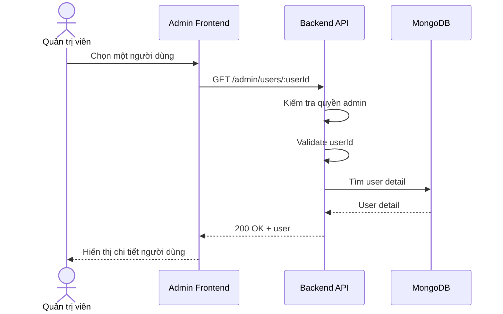

# Software Requirement Specification (SRS)
## Chức năng: Xem chi tiết người dùng quản trị (Admin Get User Detail)

### Mermaid Sequence Diagram

**Mã chức năng:** ADMIN-USERS-DETAIL-01  
**Trạng thái:** Draft / Review  
**Người soạn thảo:** Nguyễn Trọng An  
**Vai trò:** Technical Writer / Developer

---

### 1. Mô tả tổng quan (Description)
Chức năng xem chi tiết người dùng cho phép admin mở thông tin chi tiết của một tài khoản ứng viên hoặc user thông thường. API hiện tại được triển khai tại `GET /admin/users/:userId`.

### 2. Luồng nghiệp vụ (User Workflow)
| Bước | Hành động người dùng | Phản hồi hệ thống |
| :--- | :--- | :--- |
| 1 | Admin chọn user cần xem | Frontend gọi API chi tiết. |
| 2 | Backend validate `userId` | Kiểm tra tham số. |
| 3 | Backend tải user | Dùng middleware tìm user hoặc trả lỗi. |
| 4 | Hoàn tất | Trả dữ liệu chi tiết user. |

### 3. Yêu cầu dữ liệu (Data Requirements)
#### 3.1. Dữ liệu đầu vào (Input Fields)
* **userId:** Mongo ObjectId hợp lệ.

#### 3.2. Dữ liệu đầu ra (Response Data)
* `status`
* `data.user`

#### 3.3. Dữ liệu lưu trữ / truy xuất
* Collection `users`

### 4. Ràng buộc kỹ thuật & bảo mật (Technical Constraints)
* Chỉ admin được truy cập.

### 5. Trường hợp ngoại lệ & xử lý lỗi (Edge Cases)
* **Trường hợp:** Không tìm thấy user.  
  * **Xử lý:** Trả `404 Not Found`.

### 6. Giao diện (UI/UX)
* Nên có modal hoặc trang riêng hiển thị đầy đủ thông tin user.

---
