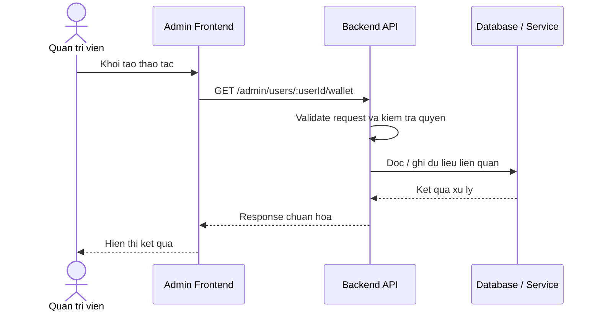

# Software Requirement Specification (SRS)
## Chuc nang: Quan tri xem vi cua nguoi dung

### Mermaid Sequence Diagram

**Ma chuc nang:** ADMIN-USER-WALLET-01  
**Trang thai:** Draft / Review  
**Nguoi soan thao:** Nhu Trung Hai  
**Vai tro:** Technical Writer / Developer

---

### 1. Mo ta tong quan (Description)
Chuc nang cho phep admin xem so du vi va thong tin vi cua mot nguoi dung cu the. API hien tai duoc trien khai tai `GET /admin/users/:userId/wallet`.

### 2. Luong nghiep vu (User Workflow)
| Buoc | Hanh dong nguoi dung | Phan hoi he thong |
| :--- | :--- | :--- |
| 1 | Nguoi dung / quan tri vien mo chuc nang tuong ung | Frontend chuan bi du lieu va goi API. |
| 2 | Frontend gui request den backend | Backend kiem tra du lieu dau vao, token, quyen va ngu canh nghiep vu. |
| 3 | Backend xu ly nghiep vu | He thong doc / ghi du lieu tai MongoDB hoac dich vu phu tro. |
| 4 | Hoan tat | Backend tra response dang `status`, `message`, `data` de frontend cap nhat giao dien. |

### 3. Yeu cau du lieu (Data Requirements)
#### 3.1. Du lieu dau vao (Input Fields)
* Admin session / cookie hop le.
* Path param `userId` hop le.

#### 3.2. Du lieu dau ra (Response Data)
* Thong tin vi cua user, so du hien tai va metadata lien quan.

#### 3.3. Du lieu luu tru / truy xuat
* Collection `users` va `wallets` de lay thong tin vi cua nguoi dung.

### 4. Rang buoc ky thuat & bao mat (Technical Constraints)
* Chi vai tro `ADMIN` moi truy cap duoc.
* User phai ton tai truoc khi doc vi.

### 5. Truong hop ngoai le & xu ly loi (Edge Cases)
* **Truong hop:** User khong ton tai.  
  * **Xu ly:** Tra `404`.
* **Truong hop:** User chua co vi.  
  * **Xu ly:** Tra du lieu rong hoac khoi tao theo nghiep vu hien hanh.

### 6. Giao dien (UI/UX)
* Trang admin user detail nen co tab vi rieng.
* Nen hien thi so du hien tai va thong tin dong bo gan nhat.

---
