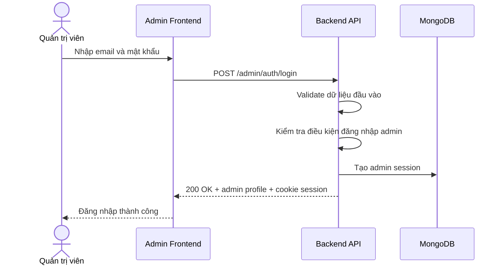

# Software Requirement Specification (SRS)
## Chức năng: Đăng nhập quản trị viên (Admin Login)

### Mermaid Sequence Diagram

**Mã chức năng:** ADMIN-AUTH-LOGIN-01  
**Trạng thái:** Draft / Review  
**Người soạn thảo:** Nhữ Trung Hải  
**Vai trò:** Technical Writer / Developer

---

### 1. Mô tả tổng quan (Description)
Chức năng đăng nhập quản trị viên cho phép tài khoản có quyền `ADMIN` truy cập khu vực quản trị. API hiện tại được triển khai tại `POST /admin/auth/login`.

### 2. Luồng nghiệp vụ (User Workflow)
| Bước | Hành động người dùng | Phản hồi hệ thống |
| :--- | :--- | :--- |
| 1 | Admin mở màn hình đăng nhập | Frontend hiển thị form login admin. |
| 2 | Admin nhập thông tin | Frontend gọi `POST /admin/auth/login`. |
| 3 | Backend validate và kiểm tra vai trò | Xác nhận tài khoản admin hợp lệ. |
| 4 | Backend tạo session | Gắn cookie/session cho admin. |
| 5 | Hoàn tất | Trả thông tin admin hiện tại. |

### 3. Yêu cầu dữ liệu (Data Requirements)
#### 3.1. Dữ liệu đầu vào (Input Fields)
* Body theo `adminLoginValidator`.

#### 3.2. Dữ liệu đầu ra (Response Data)
* `status`
* `data.admin`
* Session/cookie xác thực admin

#### 3.3. Dữ liệu lưu trữ / truy xuất
* Tài khoản admin
* Dữ liệu admin sessions

### 4. Ràng buộc kỹ thuật & bảo mật (Technical Constraints)
* Chỉ tài khoản có quyền `ADMIN` mới đăng nhập khu vực quản trị.
* Có middleware riêng cho admin login.

### 5. Trường hợp ngoại lệ & xử lý lỗi (Edge Cases)
* **Trường hợp:** Sai thông tin đăng nhập.  
  * **Xử lý:** Trả `401 Unauthorized`.
* **Trường hợp:** Tài khoản không có quyền admin.  
  * **Xử lý:** Từ chối đăng nhập khu vực quản trị.

### 6. Giao diện (UI/UX)
* Form admin login nên tách biệt với login người dùng thường.

---
