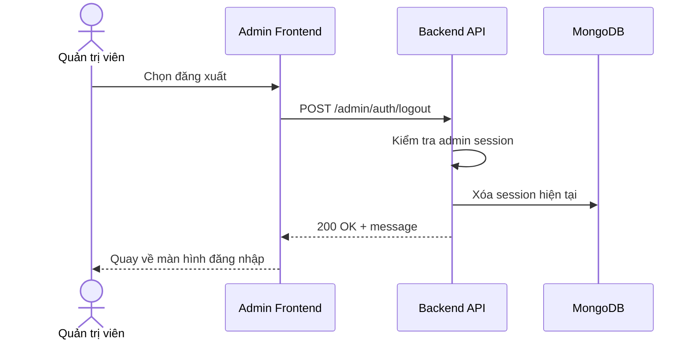

# Software Requirement Specification (SRS)
## Chức năng: Đăng xuất quản trị viên (Admin Logout)

### Mermaid Sequence Diagram

**Mã chức năng:** ADMIN-AUTH-LOGOUT-01  
**Trạng thái:** Draft / Review  
**Người soạn thảo:** Phạm Nguyễn Hưng  
**Vai trò:** Technical Writer / Developer

---

### 1. Mô tả tổng quan (Description)
Chức năng đăng xuất quản trị viên cho phép kết thúc admin session hiện tại. API được triển khai tại `POST /admin/auth/logout`.

### 2. Luồng nghiệp vụ (User Workflow)
| Bước | Hành động người dùng | Phản hồi hệ thống |
| :--- | :--- | :--- |
| 1 | Admin bấm đăng xuất | Frontend gọi API logout. |
| 2 | Backend xác thực session | Kiểm tra session admin hiện tại. |
| 3 | Backend xóa session | Hủy session và cookie tương ứng. |
| 4 | Hoàn tất | Trả thông báo thành công. |

### 3. Yêu cầu dữ liệu (Data Requirements)
#### 3.1. Dữ liệu đầu vào (Input Fields)
* Admin session/cookie hợp lệ.

#### 3.2. Dữ liệu đầu ra (Response Data)
* `status`
* `message`

#### 3.3. Dữ liệu lưu trữ / truy xuất
* Admin sessions

### 4. Ràng buộc kỹ thuật & bảo mật (Technical Constraints)
* Route yêu cầu `adminAuthMiddleware` và `authorizeAdmin`.

### 5. Trường hợp ngoại lệ & xử lý lỗi (Edge Cases)
* **Trường hợp:** Session không còn hợp lệ.  
  * **Xử lý:** Trả lỗi xác thực.

### 6. Giao diện (UI/UX)
* Sau logout cần xóa trạng thái đăng nhập phía client admin.

---
