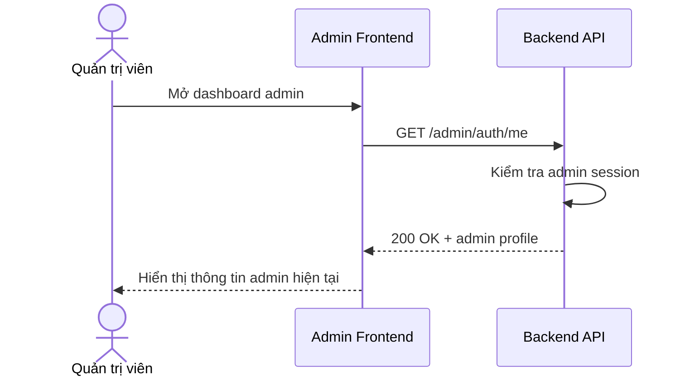

# Software Requirement Specification (SRS)
## Chức năng: Xem thông tin quản trị viên hiện tại (Admin Me)

### Mermaid Sequence Diagram

**Mã chức năng:** ADMIN-AUTH-ME-01  
**Trạng thái:** Draft / Review  
**Người soạn thảo:** Nguyễn Trọng An  
**Vai trò:** Technical Writer / Developer

---

### 1. Mô tả tổng quan (Description)
Chức năng xem thông tin quản trị viên hiện tại cho phép frontend quản trị lấy dữ liệu phiên đăng nhập đang hoạt động. API hiện tại được triển khai tại `GET /admin/auth/me`.

### 2. Luồng nghiệp vụ (User Workflow)
| Bước | Hành động người dùng | Phản hồi hệ thống |
| :--- | :--- | :--- |
| 1 | Admin mở trang quản trị | Frontend gọi API `me`. |
| 2 | Backend xác thực session | Kiểm tra quyền `ADMIN`. |
| 3 | Hoàn tất | Trả profile admin hiện tại. |

### 3. Yêu cầu dữ liệu (Data Requirements)
#### 3.1. Dữ liệu đầu vào (Input Fields)
* Admin session/cookie hợp lệ.

#### 3.2. Dữ liệu đầu ra (Response Data)
* `status`
* `data.admin`

#### 3.3. Dữ liệu lưu trữ / truy xuất
* Dữ liệu admin session hiện tại

### 4. Ràng buộc kỹ thuật & bảo mật (Technical Constraints)
* Route bảo vệ bằng `adminAuthMiddleware` và `authorizeAdmin`.

### 5. Trường hợp ngoại lệ & xử lý lỗi (Edge Cases)
* **Trường hợp:** Không phải admin.  
  * **Xử lý:** Trả lỗi phân quyền.

### 6. Giao diện (UI/UX)
* Frontend admin nên gọi route này khi khởi tạo layout quản trị.

---
