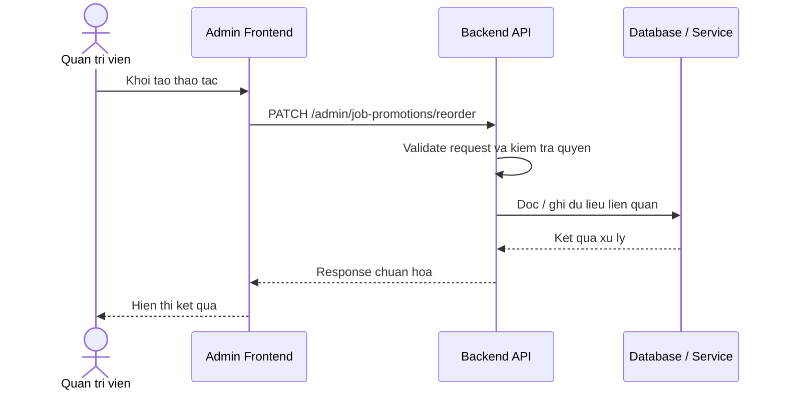

# Software Requirement Specification (SRS)
## Chuc nang: Quan tri sap xep lai thu tu quang ba viec lam

### Mermaid Sequence Diagram

**Ma chuc nang:** ADMIN-JOB-PROMOTION-REORDER-01  
**Trang thai:** Draft / Review  
**Nguoi soan thao:** Nhu Trung Hai  
**Vai tro:** Technical Writer / Developer

---

### 1. Mo ta tong quan (Description)
Chuc nang cho phep admin thay doi thu tu uu tien cua cac promotion de dieu chinh logic hien thi ngoai frontend. API hien tai duoc trien khai tai `PATCH /admin/job-promotions/reorder`.

### 2. Luong nghiep vu (User Workflow)
| Buoc | Hanh dong nguoi dung | Phan hoi he thong |
| :--- | :--- | :--- |
| 1 | Nguoi dung / quan tri vien mo chuc nang tuong ung | Frontend chuan bi du lieu va goi API. |
| 2 | Frontend gui request den backend | Backend kiem tra du lieu dau vao, token, quyen va ngu canh nghiep vu. |
| 3 | Backend xu ly nghiep vu | He thong doc / ghi du lieu tai MongoDB hoac dich vu phu tro. |
| 4 | Hoan tat | Backend tra response dang `status`, `message`, `data` de frontend cap nhat giao dien. |

### 3. Yeu cau du lieu (Data Requirements)
#### 3.1. Du lieu dau vao (Input Fields)
* Admin session hop le.
* Body danh sach thu tu moi theo validator `reorderAdminJobPromotionsValidator`.

#### 3.2. Du lieu dau ra (Response Data)
* Thong bao sap xep thanh cong.
* Danh sach thu tu sau khi cap nhat neu backend tra ve.

#### 3.3. Du lieu luu tru / truy xuat
* Collection `job_promotions`.

### 4. Rang buoc ky thuat & bao mat (Technical Constraints)
* Chi admin moi duoc reorder.
* Can cap nhat theo batch de tranh trang thai thu tu khong nhat quan.

### 5. Truong hop ngoai le & xu ly loi (Edge Cases)
* **Truong hop:** Danh sach reorder thieu ID hoac trung thu tu.  
  * **Xu ly:** Tra loi validate.
* **Truong hop:** Co promotion khong ton tai trong danh sach reorder.  
  * **Xu ly:** Tra loi nghiep vu.

### 6. Giao dien (UI/UX)
* Nen ho tro drag-and-drop hoac bang nhap thu tu.
* Sau khi luu can refresh thu tu moi ngay.

---
