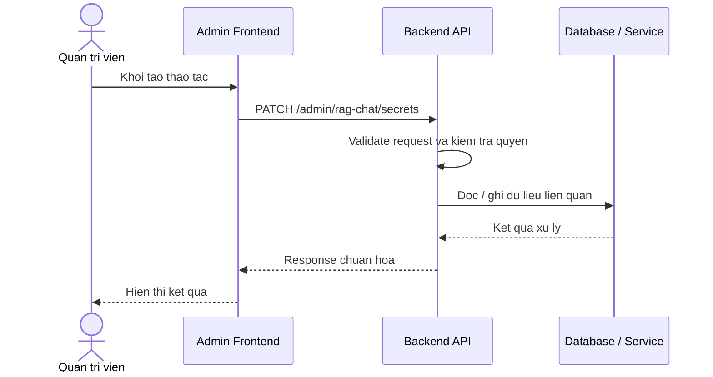

# Software Requirement Specification (SRS)
## Chuc nang: Quan tri xoay vong secret RAG chat

### Mermaid Sequence Diagram

**Ma chuc nang:** ADMIN-RAG-CHAT-SECRETS-ROTATE-01  
**Trang thai:** Draft / Review  
**Nguoi soan thao:** Nhu Trung Hai  
**Vai tro:** Technical Writer / Developer

---

### 1. Mo ta tong quan (Description)
Chuc nang cho phep admin thay doi cac khoa bi mat dung cho RAG chat, embedding hoac provider AI. API hien tai duoc trien khai tai `PATCH /admin/rag-chat/secrets`.

### 2. Luong nghiep vu (User Workflow)
| Buoc | Hanh dong nguoi dung | Phan hoi he thong |
| :--- | :--- | :--- |
| 1 | Nguoi dung / quan tri vien mo chuc nang tuong ung | Frontend chuan bi du lieu va goi API. |
| 2 | Frontend gui request den backend | Backend kiem tra du lieu dau vao, token, quyen va ngu canh nghiep vu. |
| 3 | Backend xu ly nghiep vu | He thong doc / ghi du lieu tai MongoDB hoac dich vu phu tro. |
| 4 | Hoan tat | Backend tra response dang `status`, `message`, `data` de frontend cap nhat giao dien. |

### 3. Yeu cau du lieu (Data Requirements)
#### 3.1. Du lieu dau vao (Input Fields)
* Admin session hop le.
* Body theo validator `rotateAdminRagChatSecretsValidator`.

#### 3.2. Du lieu dau ra (Response Data)
* Thong bao rotate thanh cong.
* Thong tin config sau rotate o dang da che giau secret.

#### 3.3. Du lieu luu tru / truy xuat
* System settings chua secret cua OpenAI / Gemini / embedding service.

### 4. Rang buoc ky thuat & bao mat (Technical Constraints)
* La thao tac nhay cam, chi admin moi duoc thuc hien.
* Can audit log va ma hoa secret khi luu.

### 5. Truong hop ngoai le & xu ly loi (Edge Cases)
* **Truong hop:** Thieu secret moi.  
  * **Xu ly:** Tra `422`.
* **Truong hop:** Rotate xong nhung health check that bai.  
  * **Xu ly:** Tra canh bao hoac yeu cau cau hinh lai.

### 6. Giao dien (UI/UX)
* Nut rotate secret phai co xac nhan manh.
* Sau khi doi secret nen khuyen nghi admin kiem tra health ngay.

---
