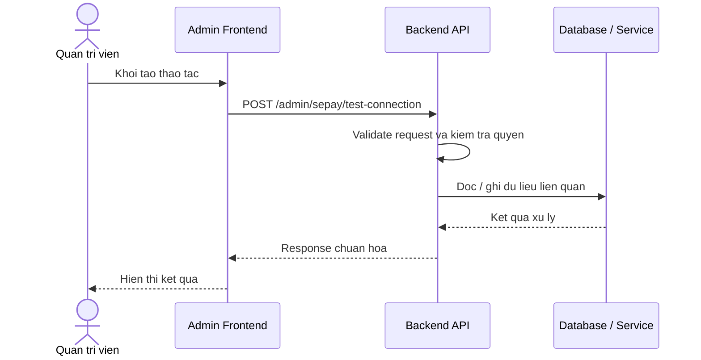

# Software Requirement Specification (SRS)
## Chuc nang: Quan tri kiem tra ket noi SePay

### Mermaid Sequence Diagram

**Ma chuc nang:** ADMIN-SEPAY-TEST-CONNECTION-01  
**Trang thai:** Draft / Review  
**Nguoi soan thao:** Nhu Trung Hai  
**Vai tro:** Technical Writer / Developer

---

### 1. Mo ta tong quan (Description)
Chuc nang cho phep admin kiem tra nhanh ket noi thuc te giua he thong va SePay. API hien tai duoc trien khai tai `POST /admin/sepay/test-connection`.

### 2. Luong nghiep vu (User Workflow)
| Buoc | Hanh dong nguoi dung | Phan hoi he thong |
| :--- | :--- | :--- |
| 1 | Nguoi dung / quan tri vien mo chuc nang tuong ung | Frontend chuan bi du lieu va goi API. |
| 2 | Frontend gui request den backend | Backend kiem tra du lieu dau vao, token, quyen va ngu canh nghiep vu. |
| 3 | Backend xu ly nghiep vu | He thong doc / ghi du lieu tai MongoDB hoac dich vu phu tro. |
| 4 | Hoan tat | Backend tra response dang `status`, `message`, `data` de frontend cap nhat giao dien. |

### 3. Yeu cau du lieu (Data Requirements)
#### 3.1. Du lieu dau vao (Input Fields)
* Admin session hop le.

#### 3.2. Du lieu dau ra (Response Data)
* Ket qua test connection thanh cong / that bai cung thong diep chan doan.

#### 3.3. Du lieu luu tru / truy xuat
* Khong ghi DB bat buoc; co the doc cau hinh SePay hien tai de thuc hien test.

### 4. Rang buoc ky thuat & bao mat (Technical Constraints)
* Chi admin moi dung duoc.
* API nay phu thuoc tinh san sang cua dich vu SePay ben ngoai.

### 5. Truong hop ngoai le & xu ly loi (Edge Cases)
* **Truong hop:** SePay timeout hoac tra loi.  
  * **Xu ly:** Tra ket qua test that bai cung thong diep chan doan.
* **Truong hop:** Thieu cau hinh SePay.  
  * **Xu ly:** Tra loi nghiep vu yeu cau cau hinh truoc.

### 6. Giao dien (UI/UX)
* Trang config nen co nut "Test connection".
* Nen hien thi log ngan gon cua lan test gan nhat.

---
