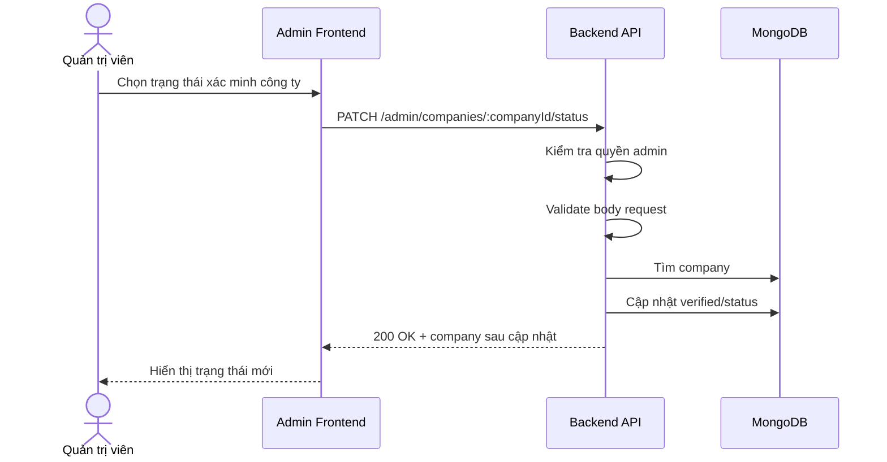

# Software Requirement Specification (SRS)
## Chức năng: Cập nhật trạng thái xác minh công ty quản trị (Admin Update Company Status)

### Mermaid Sequence Diagram

**Mã chức năng:** ADMIN-COMPANY-STATUS-01  
**Trạng thái:** Draft / Review  
**Người soạn thảo:** Nhữ Trung Hải  
**Vai trò:** Technical Writer / Developer

---

### 1. Mô tả tổng quan (Description)
Chức năng cập nhật trạng thái công ty cho phép admin xác minh hoặc thay đổi trạng thái kiểm duyệt của hồ sơ doanh nghiệp. API được triển khai tại `PATCH /admin/companies/:companyId/status`.

### 2. Luồng nghiệp vụ (User Workflow)
| Bước | Hành động người dùng | Phản hồi hệ thống |
| :--- | :--- | :--- |
| 1 | Admin chọn trạng thái mới | Frontend gửi request cập nhật company status. |
| 2 | Backend validate dữ liệu | Kiểm tra `companyId` và body. |
| 3 | Backend tải company | Xác nhận company tồn tại. |
| 4 | Backend cập nhật trạng thái | Ghi thay đổi verified/status. |
| 5 | Hoàn tất | Trả dữ liệu company sau cập nhật. |

### 3. Yêu cầu dữ liệu (Data Requirements)
#### 3.1. Dữ liệu đầu vào (Input Fields)
* **companyId:** Mongo ObjectId hợp lệ.
* Body theo `updateAdminCompanyStatusValidator`.

#### 3.2. Dữ liệu đầu ra (Response Data)
* `status`
* `message`
* `data.company`

#### 3.3. Dữ liệu lưu trữ / truy xuất
* Collection `companies`

### 4. Ràng buộc kỹ thuật & bảo mật (Technical Constraints)
* Chỉ admin mới được phép xác minh công ty.

### 5. Trường hợp ngoại lệ & xử lý lỗi (Edge Cases)
* **Trường hợp:** Company không tồn tại.  
  * **Xử lý:** Trả `404 Not Found`.
* **Trường hợp:** Dữ liệu trạng thái không hợp lệ.  
  * **Xử lý:** Trả `422 Unprocessable Entity`.

### 6. Giao diện (UI/UX)
* Nên hiển thị cảnh báo xác nhận trước khi duyệt/chặn công ty.

---
