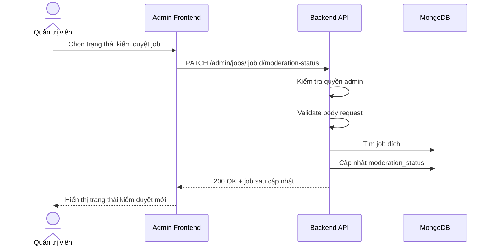

# Software Requirement Specification (SRS)
## Chức năng: Cập nhật trạng thái kiểm duyệt việc làm quản trị (Admin Update Job Moderation Status)

### Mermaid Sequence Diagram

**Mã chức năng:** ADMIN-JOB-MODERATION-01  
**Trạng thái:** Draft / Review  
**Người soạn thảo:** Nhữ Trung Hải  
**Vai trò:** Technical Writer / Developer

---

### 1. Mô tả tổng quan (Description)
Chức năng cập nhật trạng thái kiểm duyệt việc làm cho phép admin duyệt, chặn hoặc thay đổi moderation status của một tin tuyển dụng. API được triển khai tại `PATCH /admin/jobs/:jobId/moderation-status`.

### 2. Luồng nghiệp vụ (User Workflow)
| Bước | Hành động người dùng | Phản hồi hệ thống |
| :--- | :--- | :--- |
| 1 | Admin chọn trạng thái moderation mới | Frontend gửi request cập nhật. |
| 2 | Backend xác thực và validate | Kiểm tra quyền admin, `jobId` và body. |
| 3 | Backend tải job | Xác nhận tin tuyển dụng tồn tại. |
| 4 | Backend cập nhật moderation status | Lưu thêm blocked reason nếu có. |
| 5 | Hoàn tất | Trả job sau cập nhật. |

### 3. Yêu cầu dữ liệu (Data Requirements)
#### 3.1. Dữ liệu đầu vào (Input Fields)
* **jobId:** Mongo ObjectId hợp lệ.
* Body theo `updateAdminJobModerationStatusValidator`.

#### 3.2. Dữ liệu đầu ra (Response Data)
* `status`
* `message`
* `data.job`

#### 3.3. Dữ liệu lưu trữ / truy xuất
* Collection `jobs`

### 4. Ràng buộc kỹ thuật & bảo mật (Technical Constraints)
* Chỉ admin được phép thay đổi moderation status.

### 5. Trường hợp ngoại lệ & xử lý lỗi (Edge Cases)
* **Trường hợp:** Job không tồn tại.  
  * **Xử lý:** Trả `404 Not Found`.
* **Trường hợp:** Dữ liệu moderation không hợp lệ.  
  * **Xử lý:** Trả `422 Unprocessable Entity`.

### 6. Giao diện (UI/UX)
* Frontend nên yêu cầu nhập lý do khi chặn job.
* Nên hiển thị rõ job đang bị chặn hay đã được duyệt.

---
