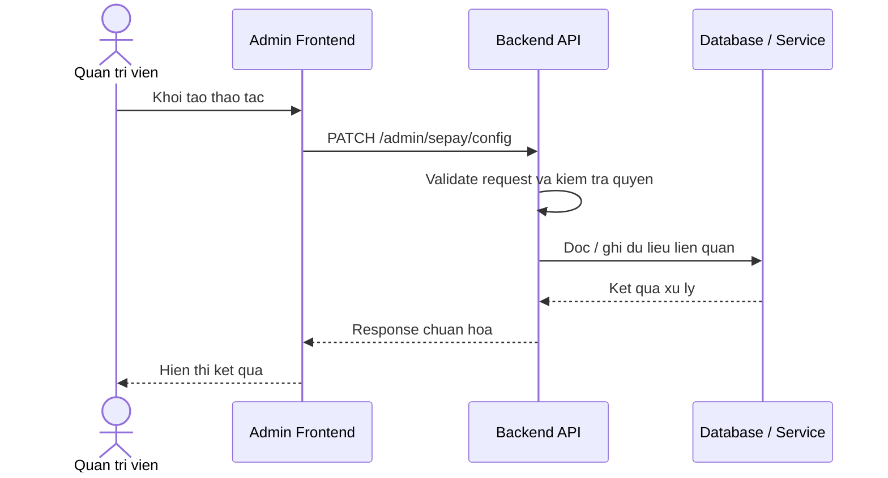

# Software Requirement Specification (SRS)
## Chuc nang: Quan tri cap nhat cau hinh SePay

### Mermaid Sequence Diagram

**Ma chuc nang:** ADMIN-SEPAY-CONFIG-UPDATE-01  
**Trang thai:** Draft / Review  
**Nguoi soan thao:** Nhu Trung Hai  
**Vai tro:** Technical Writer / Developer

---

### 1. Mo ta tong quan (Description)
Chuc nang cho phep admin cap nhat token, thong tin tai khoan hoac cac tham so tich hop SePay. API hien tai duoc trien khai tai `PATCH /admin/sepay/config`.

### 2. Luong nghiep vu (User Workflow)
| Buoc | Hanh dong nguoi dung | Phan hoi he thong |
| :--- | :--- | :--- |
| 1 | Nguoi dung / quan tri vien mo chuc nang tuong ung | Frontend chuan bi du lieu va goi API. |
| 2 | Frontend gui request den backend | Backend kiem tra du lieu dau vao, token, quyen va ngu canh nghiep vu. |
| 3 | Backend xu ly nghiep vu | He thong doc / ghi du lieu tai MongoDB hoac dich vu phu tro. |
| 4 | Hoan tat | Backend tra response dang `status`, `message`, `data` de frontend cap nhat giao dien. |

### 3. Yeu cau du lieu (Data Requirements)
#### 3.1. Du lieu dau vao (Input Fields)
* Admin session hop le.
* Body theo validator `updateAdminSePayConfigValidator`.

#### 3.2. Du lieu dau ra (Response Data)
* Thong tin cau hinh sau cap nhat o dang an toan.
* Thong bao cap nhat thanh cong.

#### 3.3. Du lieu luu tru / truy xuat
* System settings / cau hinh SePay ma hoa.

### 4. Rang buoc ky thuat & bao mat (Technical Constraints)
* Chi admin moi duoc chinh sua.
* Du lieu nhay cam phai duoc ma hoa khi luu.

### 5. Truong hop ngoai le & xu ly loi (Edge Cases)
* **Truong hop:** Body cap nhat khong hop le.  
  * **Xu ly:** Tra `422`.
* **Truong hop:** Loi ma hoa hoac luu cau hinh.  
  * **Xu ly:** Tra `500`.

### 6. Giao dien (UI/UX)
* Form config nen validate bat buoc truoc khi submit.
* Nen hien thi banner thanh cong va thoi gian cap nhat gan nhat.

---
