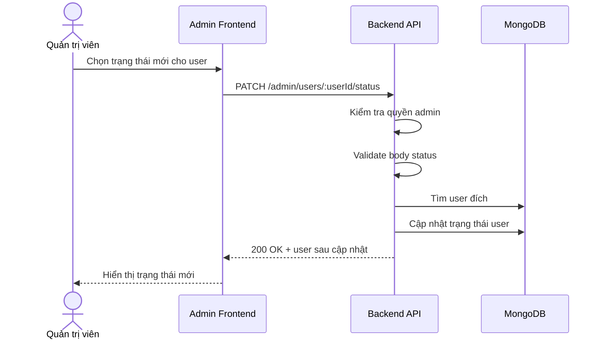

# Software Requirement Specification (SRS)
## Chức năng: Cập nhật trạng thái người dùng quản trị (Admin Update User Status)

### Mermaid Sequence Diagram

**Mã chức năng:** ADMIN-USERS-STATUS-01  
**Trạng thái:** Draft / Review  
**Người soạn thảo:** Nhữ Trung Hải  
**Vai trò:** Technical Writer / Developer

---

### 1. Mô tả tổng quan (Description)
Chức năng cập nhật trạng thái người dùng cho phép admin khóa hoặc thay đổi trạng thái tài khoản người dùng trong hệ thống. API được triển khai tại `PATCH /admin/users/:userId/status`.

### 2. Luồng nghiệp vụ (User Workflow)
| Bước | Hành động người dùng | Phản hồi hệ thống |
| :--- | :--- | :--- |
| 1 | Admin chọn trạng thái mới | Frontend gửi request cập nhật. |
| 2 | Backend validate dữ liệu | Kiểm tra `userId` và status mới. |
| 3 | Backend tải user | Xác nhận user tồn tại. |
| 4 | Backend cập nhật trạng thái | Ghi thay đổi vào database. |
| 5 | Hoàn tất | Trả thông tin user sau cập nhật. |

### 3. Yêu cầu dữ liệu (Data Requirements)
#### 3.1. Dữ liệu đầu vào (Input Fields)
* **userId:** Mongo ObjectId hợp lệ.
* Body theo `updateAdminUserStatusValidator`.

#### 3.2. Dữ liệu đầu ra (Response Data)
* `status`
* `message`
* `data.user`

#### 3.3. Dữ liệu lưu trữ / truy xuất
* Collection `users`

### 4. Ràng buộc kỹ thuật & bảo mật (Technical Constraints)
* Chỉ admin mới được cập nhật trạng thái user.

### 5. Trường hợp ngoại lệ & xử lý lỗi (Edge Cases)
* **Trường hợp:** User không tồn tại.  
  * **Xử lý:** Trả `404 Not Found`.
* **Trường hợp:** Trạng thái không hợp lệ.  
  * **Xử lý:** Trả `422 Unprocessable Entity`.

### 6. Giao diện (UI/UX)
* Giao diện admin nên xác nhận trước khi khóa tài khoản.

---
