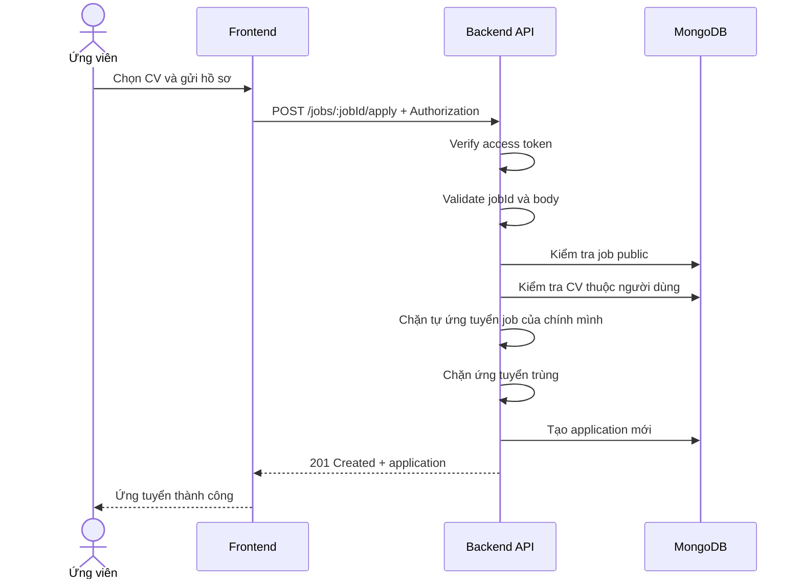

# Software Requirement Specification (SRS)
## Chức năng: Ứng tuyển việc làm (Apply Job)

### Mermaid Sequence Diagram

**Mã chức năng:** JOB-APPLY-01  
**Trạng thái:** Draft / Review  
**Người soạn thảo:** Phạm Nguyễn Hưng  
**Vai trò:** Technical Writer / Developer

---

### 1. Mô tả tổng quan (Description)
Chức năng ứng tuyển việc làm cho phép ứng viên đã đăng nhập dùng một CV đã lưu để nộp hồ sơ vào một tin tuyển dụng public. API hiện tại được triển khai tại `POST /jobs/:jobId/apply`.

### 2. Luồng nghiệp vụ (User Workflow)
| Bước | Hành động người dùng | Phản hồi hệ thống |
| :--- | :--- | :--- |
| 1 | Người dùng mở form ứng tuyển | Frontend hiển thị danh sách CV. |
| 2 | Người dùng chọn CV và nhập cover letter | Frontend gửi `POST /jobs/:jobId/apply`. |
| 3 | Backend xác thực người dùng | Yêu cầu access token hợp lệ. |
| 4 | Backend kiểm tra điều kiện ứng tuyển | Job phải public, CV phải thuộc user, không tự ứng tuyển, chưa ứng tuyển trước đó. |
| 5 | Backend tạo hồ sơ ứng tuyển | Lưu application mới với snapshot CV cần thiết. |
| 6 | Hoàn tất | Trả `201 Created` và dữ liệu application. |

### 3. Yêu cầu dữ liệu (Data Requirements)
#### 3.1. Dữ liệu đầu vào (Input Fields)
* **Authorization:** `Bearer access token`, bắt buộc.
* **jobId:** Mongo ObjectId hợp lệ.
* **cv_id:** Mongo ObjectId của CV thuộc user, bắt buộc.
* **cover_letter:** `string`, tùy chọn.

#### 3.2. Dữ liệu đầu ra (Response Data)
* `status`: `success`
* `message`: thông báo ứng tuyển thành công
* `data`: thông tin hồ sơ ứng tuyển mới tạo

#### 3.3. Dữ liệu lưu trữ / truy xuất
* Collection `jobs`
* Collection `resumes`
* Collection `job applications`

### 4. Ràng buộc kỹ thuật & bảo mật (Technical Constraints)
* Route bắt buộc đăng nhập.
* Có middleware kiểm tra job, resume, trạng thái trùng và quyền sở hữu.
* Ứng viên không được ứng tuyển vào job của công ty do chính mình sở hữu.

### 5. Trường hợp ngoại lệ & xử lý lỗi (Edge Cases)
* **Trường hợp:** Không đăng nhập.  
  * **Xử lý:** Trả `401 Unauthorized`.
* **Trường hợp:** CV không thuộc user hoặc không tồn tại.  
  * **Xử lý:** Trả `404 Not Found` hoặc `403 Forbidden`.
* **Trường hợp:** Đã ứng tuyển job này trước đó.  
  * **Xử lý:** Trả lỗi nghiệp vụ phù hợp.
* **Trường hợp:** Job không hợp lệ hoặc không public.  
  * **Xử lý:** Trả `404 Not Found`.

### 6. Giao diện (UI/UX)
* Form ứng tuyển nên bắt buộc chọn một CV.
* Nên hiển thị rõ trạng thái gửi hồ sơ và lỗi nếu ứng tuyển trùng.

---
