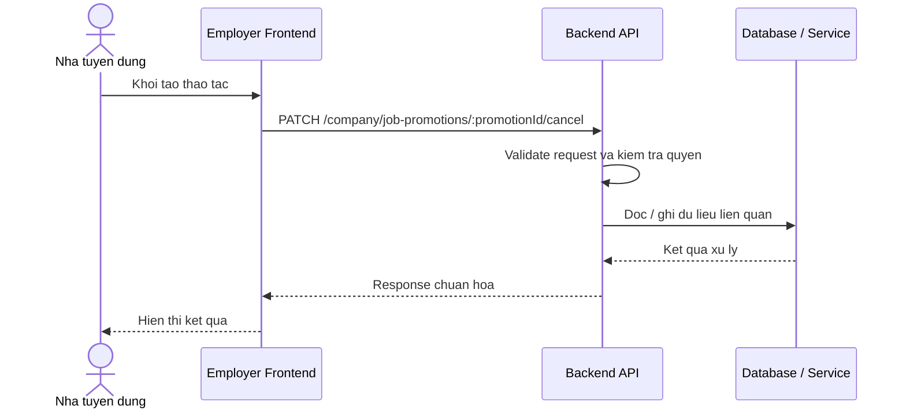

# Software Requirement Specification (SRS)
## Chuc nang: Huy chien dich quang ba job cua cong ty

### Mermaid Sequence Diagram

**Ma chuc nang:** COMPANY-JOB-PROMOTION-CANCEL-01  
**Trang thai:** Draft / Review  
**Nguoi soan thao:** Nhu Trung Hai  
**Vai tro:** Technical Writer / Developer

---

### 1. Mo ta tong quan (Description)
Chuc nang cho phep cong ty huy mot promotion dang cho hoac dang hieu luc theo quy tac nghiep vu. API hien tai duoc trien khai tai `PATCH /company/job-promotions/:promotionId/cancel`.

### 2. Luong nghiep vu (User Workflow)
| Buoc | Hanh dong nguoi dung | Phan hoi he thong |
| :--- | :--- | :--- |
| 1 | Nguoi dung / quan tri vien mo chuc nang tuong ung | Frontend chuan bi du lieu va goi API. |
| 2 | Frontend gui request den backend | Backend kiem tra du lieu dau vao, token, quyen va ngu canh nghiep vu. |
| 3 | Backend xu ly nghiep vu | He thong doc / ghi du lieu tai MongoDB hoac dich vu phu tro. |
| 4 | Hoan tat | Backend tra response dang `status`, `message`, `data` de frontend cap nhat giao dien. |

### 3. Yeu cau du lieu (Data Requirements)
#### 3.1. Du lieu dau vao (Input Fields)
* Cong ty da dang nhap va xac minh.
* Path param `promotionId` hop le.

#### 3.2. Du lieu dau ra (Response Data)
* Thong bao huy thanh cong va trang thai promotion sau khi cap nhat.

#### 3.3. Du lieu luu tru / truy xuat
* Collection `job_promotions` de cap nhat trang thai chien dich.

### 4. Rang buoc ky thuat & bao mat (Technical Constraints)
* Chi huy duoc promotion thuoc cong ty hien tai va o trang thai cho phep.
* Can kiem soat transition trang thai hop le.

### 5. Truong hop ngoai le & xu ly loi (Edge Cases)
* **Truong hop:** Promotion da het han hoac da huy truoc do.  
  * **Xu ly:** Tra loi nghiep vu.
* **Truong hop:** Promotion khong ton tai.  
  * **Xu ly:** Tra `404`.

### 6. Giao dien (UI/UX)
* Thao tac huy can co hop thoai xac nhan.
* Sau khi huy phai refresh lai danh sach promotion.

---
