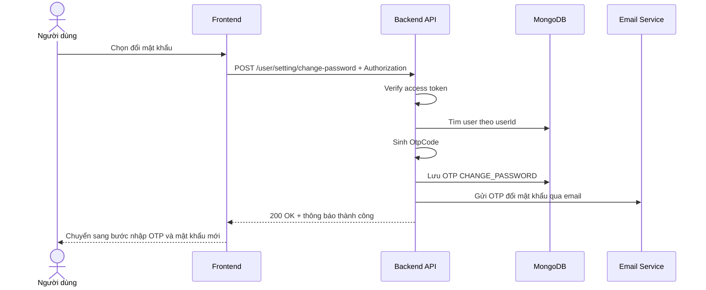

# Software Requirement Specification (SRS)
## Chức năng: Yêu cầu OTP đổi mật khẩu (Change Password)

### Mermaid Sequence Diagram

**Mã chức năng:** USER-CHANGE-PASSWORD-01  
**Trạng thái:** Draft / Review  
**Người soạn thảo:** Phạm Nguyễn Hưng  
**Vai trò:** Technical Writer / Developer

---

### 1. Mô tả tổng quan (Description)
Chức năng `change-password` trong source hiện tại là bước khởi tạo luồng đổi mật khẩu, có nhiệm vụ sinh OTP và gửi OTP đó về email của người dùng đã đăng nhập. API được triển khai tại `POST /user/setting/change-password`. Việc cập nhật mật khẩu thực tế được thực hiện ở API kế tiếp `POST /user/setting/new-password`.

### 2. Luồng nghiệp vụ (User Workflow)
| Bước | Hành động người dùng | Phản hồi hệ thống |
| :--- | :--- | :--- |
| 1 | Người dùng chọn tính năng đổi mật khẩu | Frontend gọi `POST /user/setting/change-password`. |
| 2 | Hệ thống xác thực phiên đăng nhập | Middleware `isAuthorized` kiểm tra access token. |
| 3 | Hệ thống lấy email người dùng | Truy vấn user hiện tại từ MongoDB. |
| 4 | Hệ thống sinh OTP | Tạo `OtpCode` ngẫu nhiên cho loại `CHANGE_PASSWORD`. |
| 5 | Hệ thống lưu OTP | Xóa OTP cũ cùng loại rồi lưu OTP mới vào collection `otpCodes`. |
| 6 | Hệ thống gửi email OTP | Gửi OTP qua Resend hoặc log OTP ở môi trường dev. |
| 7 | Hoàn tất | Trả `200 OK` để frontend chuyển sang bước nhập OTP và mật khẩu mới. |

### 3. Yêu cầu dữ liệu (Data Requirements)
#### 3.1. Dữ liệu đầu vào (Input Fields)
* **Authorization header:** bắt buộc, định dạng `Bearer <access_token>`.
* Route hiện tại không yêu cầu body.

#### 3.2. Dữ liệu đầu ra (Response Data)
Khi thành công, hệ thống trả về:
* `status`: `success`
* `message`: `Gửi lại email thành công hãy kiểm tra hòm thư của bạn`

#### 3.3. Dữ liệu lưu trữ / truy xuất
* **Collection `users`:** lấy thông tin email và họ tên người dùng hiện tại.
* **Collection `otpCodes`:** lưu OTP với `type = CHANGE_PASSWORD`.

### 4. Ràng buộc kỹ thuật & bảo mật (Technical Constraints)
* Route bắt buộc đăng nhập.
* OTP được sinh bằng hàm `generateOtpChangePassword()`, hiện cho ra chuỗi ngẫu nhiên độ dài khoảng 8 ký tự.
* TTL của OTP đổi mật khẩu đang tái sử dụng cấu hình `ExpiresIn_FORGOT_PASSWORD_TOKEN`.
* Source hiện tại chưa có validator body, chưa yêu cầu nhập mật khẩu cũ và chưa gắn rate-limit riêng cho route này.
* Ở môi trường dev, OTP được in ra console.

### 5. Trường hợp ngoại lệ & xử lý lỗi (Edge Cases)
* **Trường hợp:** Không gửi access token.  
  * **Xử lý:** Trả `401 Unauthorized`.
* **Trường hợp:** User không tồn tại dù token hợp lệ.  
  * **Xử lý:** Có thể phát sinh lỗi nội bộ khi truy cập `user.email`.
* **Trường hợp:** Lỗi lưu OTP hoặc lỗi gửi email.  
  * **Xử lý:** Trả `500 Internal Server Error`.

### 6. Giao diện (UI/UX)
* Nút "Gửi OTP đổi mật khẩu" nên là bước đầu tiên của flow đổi mật khẩu.
* Sau khi API thành công, giao diện nên chuyển sang form nhập `OtpCode`, `newPassword`, `confirmNewPassword`.
* Vì message trả về đang dùng lại chuỗi gửi mail chung, frontend nên hiển thị nội dung theo ngữ cảnh "OTP đã được gửi qua email".

---
