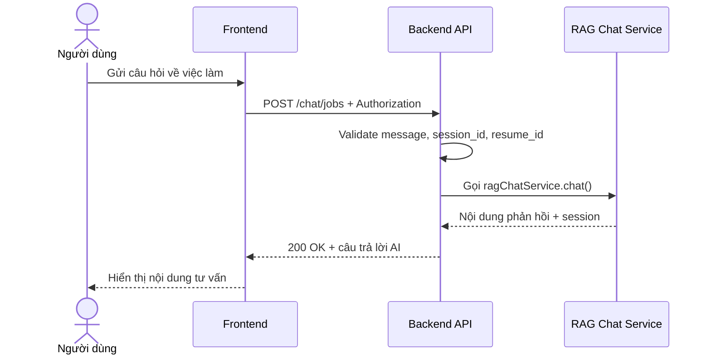

# Software Requirement Specification (SRS)
## Chức năng: Chat tư vấn việc làm (Chat Jobs)

### Mermaid Sequence Diagram

**Mã chức năng:** CHAT-JOBS-01  
**Trạng thái:** Draft / Review  
**Người soạn thảo:** Phạm Nguyễn Hưng  
**Vai trò:** Technical Writer / Developer

---

### 1. Mô tả tổng quan (Description)
Chức năng chat tư vấn việc làm cho phép người dùng gửi câu hỏi liên quan đến job, CV hoặc định hướng ứng tuyển. API hiện tại được triển khai tại `POST /chat/jobs`.

### 2. Luồng nghiệp vụ (User Workflow)
| Bước | Hành động người dùng | Phản hồi hệ thống |
| :--- | :--- | :--- |
| 1 | Người dùng nhập câu hỏi | Frontend chuẩn bị nội dung chat. |
| 2 | Frontend gửi request | Gọi `POST /chat/jobs`. |
| 3 | Backend validate dữ liệu | Kiểm tra `message`, `session_id`, `resume_id`. |
| 4 | Backend gọi dịch vụ AI | Chuyển dữ liệu sang `ragChatService`. |
| 5 | Hoàn tất | Trả câu trả lời và metadata phiên chat. |

### 3. Yêu cầu dữ liệu (Data Requirements)
#### 3.1. Dữ liệu đầu vào (Input Fields)
* **Authorization:** bắt buộc theo route hiện tại.
* **message:** `string`, bắt buộc.
* **session_id:** `string`, tùy chọn.
* **resume_id:** `string`, tùy chọn.

#### 3.2. Dữ liệu đầu ra (Response Data)
* `status`
* `data`: nội dung phản hồi chat, session liên quan

#### 3.3. Dữ liệu lưu trữ / truy xuất
* Dữ liệu session chat
* Dữ liệu resume được gắn vào ngữ cảnh nếu có

### 4. Ràng buộc kỹ thuật & bảo mật (Technical Constraints)
* Route hiện tại được bảo vệ bởi `isAuthorized`.
* Message phải qua validator trước khi gọi AI service.

### 5. Trường hợp ngoại lệ & xử lý lỗi (Edge Cases)
* **Trường hợp:** Message rỗng hoặc quá ngắn.  
  * **Xử lý:** Trả `422 Unprocessable Entity`.
* **Trường hợp:** Session không hợp lệ.  
  * **Xử lý:** Trả lỗi nghiệp vụ.
* **Trường hợp:** AI service lỗi.  
  * **Xử lý:** Trả `500 Internal Server Error`.

### 6. Giao diện (UI/UX)
* Nên hiển thị trạng thái đang trả lời.
* Nên giữ lại lịch sử hội thoại theo phiên.

---
