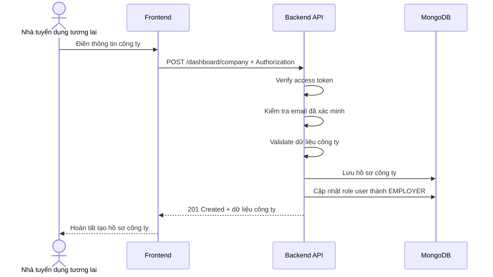

# Software Requirement Specification (SRS)
## Chức năng: Tạo hồ sơ công ty (Create Company)

### Mermaid Sequence Diagram

**Mã chức năng:** COMPANY-CREATE-01  
**Trạng thái:** Draft / Review  
**Người soạn thảo:** Nhữ Trung Hải  
**Vai trò:** Technical Writer / Developer

---

### 1. Mô tả tổng quan (Description)
Chức năng tạo hồ sơ công ty cho phép người dùng đã đăng nhập và đã xác minh email tạo thông tin doanh nghiệp để chuyển sang vai trò nhà tuyển dụng. API hiện tại được triển khai tại `POST /dashboard/company`. Sau khi tạo công ty thành công, hệ thống cập nhật `role` của user thành `EMPLOYER`.

### 2. Luồng nghiệp vụ (User Workflow)
| Bước | Hành động người dùng | Phản hồi hệ thống |
| :--- | :--- | :--- |
| 1 | Người dùng mở form tạo hồ sơ công ty | Frontend hiển thị các trường thông tin doanh nghiệp. |
| 2 | Người dùng điền thông tin và gửi | Frontend gọi `POST /dashboard/company`. |
| 3 | Hệ thống xác thực và kiểm tra email | Middleware `isAuthorized` và `isVerified` kiểm tra phiên đăng nhập và trạng thái xác minh email. |
| 4 | Hệ thống validate dữ liệu công ty | Kiểm tra `company_name`, `address`, `website`, `logo`, `description`. |
| 5 | Hệ thống lưu hồ sơ công ty | Tạo document mới trong collection `companies`, gắn `user_id` là người tạo. |
| 6 | Hệ thống cập nhật vai trò người dùng | Đổi `role` thành `EMPLOYER`. |
| 7 | Hoàn tất | Trả `201 Created` cùng dữ liệu hồ sơ công ty vừa tạo. |

### 3. Yêu cầu dữ liệu (Data Requirements)
#### 3.1. Dữ liệu đầu vào (Input Fields)
* **company_name:** `string`, bắt buộc, từ `2` đến `100` ký tự.
* **address:** `string`, bắt buộc, từ `2` đến `100` ký tự.
* **website:** `string`, tùy chọn, phải là URL hợp lệ.
* **logo:** `string`, tùy chọn, phải là URL hợp lệ.
* **description:** `string`, tùy chọn, tối đa `500` ký tự.

#### 3.2. Dữ liệu đầu ra (Response Data)
Khi thành công, hệ thống trả về:
* `status`: `success`
* `message`: `Tạo hồ sơ công ty thành công`
* `data._id`: ID hồ sơ công ty
* `data.user_id`: ID người tạo
* `data.company_name`
* `data.logo`
* `data.website`
* `data.address`
* `data.description`
* `data.verified`
* `data.created_at`
* `data.updated_at`

#### 3.3. Dữ liệu lưu trữ / truy xuất
* **JWT Access Token:** lấy `userId`.
* **Collection `companies`:** lưu hồ sơ công ty mới.
* **Collection `users`:** cập nhật `role = EMPLOYER`.

### 4. Ràng buộc kỹ thuật & bảo mật (Technical Constraints)
* Route nằm dưới `/dashboard`, nên mặc định bắt buộc đăng nhập và email đã xác minh.
* Validate dùng `createCompanyValidator`.
* Các chuỗi như tên công ty, địa chỉ, mô tả được `trim()` và `escape()`.
* Sau khi tạo company, hệ thống cập nhật role user thành `EMPLOYER`.
* Source hiện tại chưa kiểm tra một người dùng đã có hồ sơ công ty trước đó hay chưa, dù constants đã có message `COMPANY_PROFILE_ALREADY_EXISTS`.
* Source hiện tại cũng chưa dùng transaction để gói chung thao tác tạo company và cập nhật role.

### 5. Trường hợp ngoại lệ & xử lý lỗi (Edge Cases)
* **Trường hợp:** Không gửi access token.  
  * **Xử lý:** Trả `401 Unauthorized`.
* **Trường hợp:** Email chưa xác minh.  
  * **Xử lý:** Trả `401 Unauthorized`.
* **Trường hợp:** `website` hoặc `logo` không phải URL hợp lệ.  
  * **Xử lý:** Trả `422 Unprocessable Entity`.
* **Trường hợp:** Thiếu `company_name` hoặc `address`.  
  * **Xử lý:** Trả `422 Unprocessable Entity`.
* **Trường hợp:** User đã từng tạo company trước đó.  
  * **Xử lý:** Source hiện tại chưa chặn, nên có nguy cơ tạo trùng hồ sơ công ty.
* **Trường hợp:** Lỗi khi tạo company hoặc cập nhật role người dùng.  
  * **Xử lý:** Trả `500 Internal Server Error`, và có thể phát sinh dữ liệu lệch trạng thái vì chưa dùng transaction.

### 6. Giao diện (UI/UX)
* Form tạo công ty nên yêu cầu ít nhất tên công ty và địa chỉ.
* Frontend nên kiểm tra URL ở client trước để giảm lỗi validate.
* Sau khi tạo thành công, giao diện có thể điều hướng người dùng sang dashboard nhà tuyển dụng.

---
