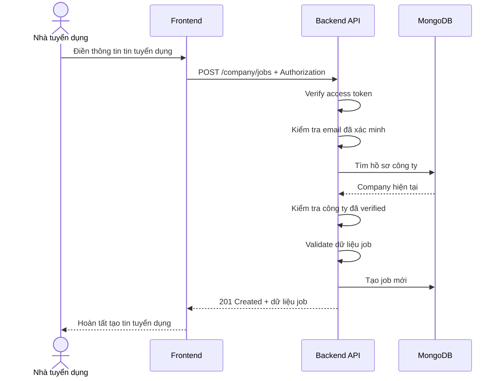

# Software Requirement Specification (SRS)
## Chức năng: Tạo tin tuyển dụng (Create Job)

### Mermaid Sequence Diagram

**Mã chức năng:** JOB-CREATE-01  
**Trạng thái:** Draft / Review  
**Người soạn thảo:** Nhữ Trung Hải  
**Vai trò:** Technical Writer / Developer

---

### 1. Mô tả tổng quan (Description)
Chức năng tạo tin tuyển dụng cho phép nhà tuyển dụng đã có hồ sơ công ty và công ty đã được xác minh đăng tin tuyển dụng mới. API hiện tại được triển khai tại `POST /company/jobs`. Hệ thống hỗ trợ tạo tin ở trạng thái `draft` hoặc `open`; nếu tạo ở trạng thái `open` thì `published_at` sẽ được sinh tự động.

### 2. Luồng nghiệp vụ (User Workflow)
| Bước | Hành động người dùng | Phản hồi hệ thống |
| :--- | :--- | :--- |
| 1 | Người dùng mở form tạo tin tuyển dụng | Frontend hiển thị các trường về mô tả công việc, lương, kỹ năng, hạn nộp. |
| 2 | Người dùng nhập dữ liệu và gửi form | Frontend gọi `POST /company/jobs`. |
| 3 | Hệ thống xác thực người dùng | `isAuthorized` và `isVerified` kiểm tra phiên đăng nhập và email. |
| 4 | Hệ thống kiểm tra company | `loadCompany` và `requireCompany` xác nhận người dùng đã có hồ sơ công ty. |
| 5 | Hệ thống kiểm tra trạng thái xác minh công ty | `isVerifiedCompany` chỉ cho phép công ty đã được verified đăng tin. |
| 6 | Hệ thống validate dữ liệu job | `createJobValidator` kiểm tra toàn bộ body request. |
| 7 | Hệ thống tạo tin tuyển dụng | Tạo document `jobs` mới, gắn `company_id` và tính `published_at` nếu mở tuyển ngay. |
| 8 | Hoàn tất | Trả `201 Created` cùng dữ liệu job vừa tạo. |

### 3. Yêu cầu dữ liệu (Data Requirements)
#### 3.1. Dữ liệu đầu vào (Input Fields)
* **Authorization:** `Bearer access token`, bắt buộc.
* **title:** `string`, bắt buộc, từ `2` đến `200` ký tự.
* **description:** `string`, bắt buộc, từ `2` đến `5000` ký tự.
* **requirements:** `string`, bắt buộc, từ `2` đến `5000` ký tự.
* **benefits:** `string`, bắt buộc, từ `2` đến `3000` ký tự.
* **salary.min:** `number`, bắt buộc nếu `is_negotiable = false`.
* **salary.max:** `number`, bắt buộc nếu `is_negotiable = false`.
* **salary.currency:** `VND | USD`, bắt buộc.
* **salary.is_negotiable:** `boolean`, tùy chọn, mặc định `false`.
* **location:** `string`, bắt buộc, từ `2` đến `100` ký tự.
* **job_type:** `full-time | part-time | internship | contract | remote`, bắt buộc.
* **level:** `intern | fresher | junior | middle | senior | lead | manager`, bắt buộc.
* **status:** `draft | open`, tùy chọn.
* **category:** `string[]`, bắt buộc, ít nhất `1` phần tử.
* **skills:** `string[]`, bắt buộc, ít nhất `1` phần tử.
* **quantity:** `number`, bắt buộc, số nguyên lớn hơn `0`.
* **expired_at:** `date`, bắt buộc, phải lớn hơn thời điểm hiện tại.

#### 3.2. Dữ liệu đầu ra (Response Data)
Khi thành công, hệ thống trả về:
* `status`: `success`
* `message`: `Tạo tin tuyển dụng thành công`
* `data._id`
* `data.title`
* `data.description`
* `data.requirements`
* `data.benefits`
* `data.salary`
* `data.location`
* `data.job_type`
* `data.level`
* `data.status`
* `data.category`
* `data.skills`
* `data.quantity`
* `data.expired_at`
* `data.published_at`
* `data.created_at`
* `data.updated_at`

#### 3.3. Dữ liệu lưu trữ / truy xuất
* **JWT Access Token:** xác định người dùng hiện tại.
* **Collection `companies`:** lấy company theo `user_id`.
* **Collection `jobs`:** lưu tin tuyển dụng mới gắn với `company_id`.

### 4. Ràng buộc kỹ thuật & bảo mật (Technical Constraints)
* Route yêu cầu đồng thời: đăng nhập, email đã xác minh, có hồ sơ công ty và công ty đã verified.
* Dữ liệu lương được validate chéo: `max` không được nhỏ hơn `min`.
* Nếu `status = open`, backend tự gắn `published_at = new Date()`.
* Nếu không gửi `status`, model mặc định dùng `draft`.
* Các chuỗi như tiêu đề, mô tả, yêu cầu, quyền lợi, địa điểm được `trim()` và `escape()`.

### 5. Trường hợp ngoại lệ & xử lý lỗi (Edge Cases)
* **Trường hợp:** Không gửi access token hoặc email chưa xác minh.  
  * **Xử lý:** Trả `401 Unauthorized`.
* **Trường hợp:** Người dùng chưa có hồ sơ công ty.  
  * **Xử lý:** Trả `404 Not Found`.
* **Trường hợp:** Công ty chưa được xác minh.  
  * **Xử lý:** Trả `403 Forbidden`.
* **Trường hợp:** `expired_at` nhỏ hơn hoặc bằng thời điểm hiện tại.  
  * **Xử lý:** Trả `422 Unprocessable Entity`.
* **Trường hợp:** `salary.max < salary.min`.  
  * **Xử lý:** Trả `422 Unprocessable Entity`.
* **Trường hợp:** `category`, `skills` rỗng hoặc `quantity <= 0`.  
  * **Xử lý:** Trả `422 Unprocessable Entity`.
* **Trường hợp:** Lỗi lưu database.  
  * **Xử lý:** Trả `500 Internal Server Error`.

### 6. Giao diện (UI/UX)
* Form tạo job nên tách rõ các nhóm trường: thông tin chung, lương, kỹ năng, danh mục và hạn nộp.
* Frontend nên hỗ trợ chọn trạng thái `Lưu nháp` hoặc `Đăng tuyển ngay`.
* Nên validate trước ở client cho các ràng buộc lương, số lượng và hạn nộp để giảm lỗi trả về từ server.

---

