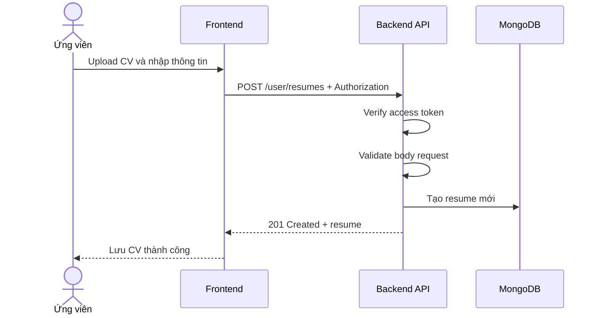

# Software Requirement Specification (SRS)
## Chức năng: Tạo CV / hồ sơ ứng tuyển (Create Resume)

### Mermaid Sequence Diagram

**Mã chức năng:** RESUME-CREATE-01  
**Trạng thái:** Draft / Review  
**Người soạn thảo:** Nhữ Trung Hải  
**Vai trò:** Technical Writer / Developer

---

### 1. Mô tả tổng quan (Description)
Chức năng tạo CV cho phép người dùng lưu một hồ sơ CV mới để phục vụ ứng tuyển. API hiện tại được triển khai tại `POST /user/resumes`.

### 2. Luồng nghiệp vụ (User Workflow)
| Bước | Hành động người dùng | Phản hồi hệ thống |
| :--- | :--- | :--- |
| 1 | Người dùng chọn file CV và nhập tiêu đề | Frontend chuẩn bị dữ liệu upload đã có URL/file key. |
| 2 | Frontend gửi request tạo resume | Gọi `POST /user/resumes`. |
| 3 | Backend xác thực và validate | Kiểm tra token và body hợp lệ. |
| 4 | Backend lưu resume | Tạo bản ghi CV mới của người dùng. |
| 5 | Hoàn tất | Trả `201 Created` cùng dữ liệu resume. |

### 3. Yêu cầu dữ liệu (Data Requirements)
#### 3.1. Dữ liệu đầu vào (Input Fields)
* **title:** `string`, bắt buộc.
* **cv_url:** `string`, bắt buộc.
* **resume_file_key:** `string`, bắt buộc.
* **is_default:** `boolean`, tùy chọn.

#### 3.2. Dữ liệu đầu ra (Response Data)
* `status`
* `message`
* `data._id`
* `data.title`
* `data.cv_url`
* `data.resume_file_key`
* `data.is_default`

#### 3.3. Dữ liệu lưu trữ / truy xuất
* Collection `resumes`

### 4. Ràng buộc kỹ thuật & bảo mật (Technical Constraints)
* Route bắt buộc đăng nhập.
* Chỉ tạo resume cho user hiện tại.

### 5. Trường hợp ngoại lệ & xử lý lỗi (Edge Cases)
* **Trường hợp:** Thiếu URL hoặc file key.  
  * **Xử lý:** Trả `422 Unprocessable Entity`.
* **Trường hợp:** Không đăng nhập.  
  * **Xử lý:** Trả `401 Unauthorized`.

### 6. Giao diện (UI/UX)
* Màn upload CV nên hỗ trợ đặt tên và chọn CV mặc định.
* Nên hiển thị tiến trình upload trước khi gọi API tạo resume.

---
