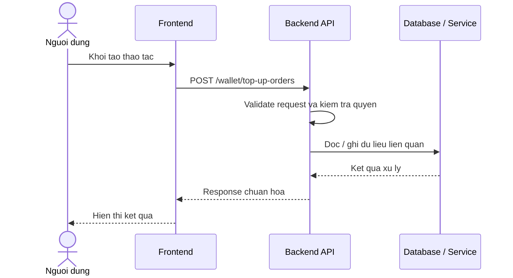

# Software Requirement Specification (SRS)
## Chuc nang: Tao lenh nap tien vi

### Mermaid Sequence Diagram

**Ma chuc nang:** WALLET-TOPUP-ORDER-CREATE-01  
**Trang thai:** Draft / Review  
**Nguoi soan thao:** Nhu Trung Hai  
**Vai tro:** Technical Writer / Developer

---

### 1. Mo ta tong quan (Description)
Chuc nang tao mot lenh nap tien vi de nguoi dung thanh toan theo ma don hang va theo doi trang thai top-up. API hien tai duoc trien khai tai `POST /wallet/top-up-orders`.

### 2. Luong nghiep vu (User Workflow)
| Buoc | Hanh dong nguoi dung | Phan hoi he thong |
| :--- | :--- | :--- |
| 1 | Nguoi dung / quan tri vien mo chuc nang tuong ung | Frontend chuan bi du lieu va goi API. |
| 2 | Frontend gui request den backend | Backend kiem tra du lieu dau vao, token, quyen va ngu canh nghiep vu. |
| 3 | Backend xu ly nghiep vu | He thong doc / ghi du lieu tai MongoDB hoac dich vu phu tro. |
| 4 | Hoan tat | Backend tra response dang `status`, `message`, `data` de frontend cap nhat giao dien. |

### 3. Yeu cau du lieu (Data Requirements)
#### 3.1. Du lieu dau vao (Input Fields)
* Header `Authorization` hop le.
* Body chua so tien / phuong thuc theo validator `createWalletTopUpOrderValidator`.

#### 3.2. Du lieu dau ra (Response Data)
* Thong tin order code, so tien, trang thai don nap vi va du lieu thanh toan di kem.

#### 3.3. Du lieu luu tru / truy xuat
* Collection `wallet_topup_orders` de tao don nap vi moi.
* Collection `wallet_transactions` neu he thong ghi nhan giao dich khoi tao.

### 4. Rang buoc ky thuat & bao mat (Technical Constraints)
* Nguoi dung phai dang nhap.
* So tien nap phai nam trong gioi han chinh sach he thong.

### 5. Truong hop ngoai le & xu ly loi (Edge Cases)
* **Truong hop:** So tien khong hop le.  
  * **Xu ly:** Tra `422`.
* **Truong hop:** Khong tao duoc order do loi he thong / SePay.  
  * **Xu ly:** Tra `500` hoac loi nghiep vu.

### 6. Giao dien (UI/UX)
* Trang nap vi nen hien thi ro order code va trang thai cho thanh toan.
* Nen co hanh dong sao chep noi dung chuyen khoan nhanh.

---
