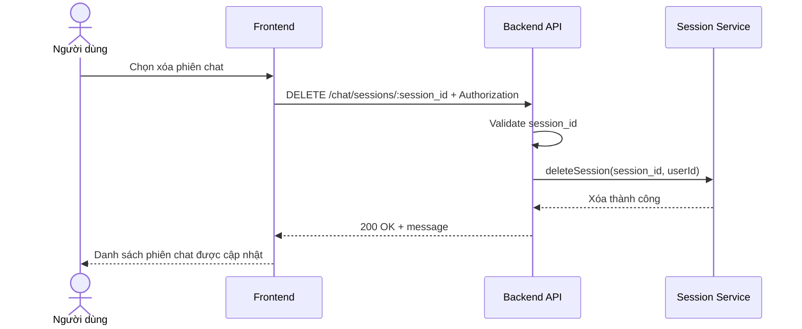

# Software Requirement Specification (SRS)
## Chức năng: Xóa phiên chat (Delete Chat Session)

### Mermaid Sequence Diagram

**Mã chức năng:** CHAT-SESSION-DELETE-01  
**Trạng thái:** Draft / Review  
**Người soạn thảo:** Phạm Nguyễn Hưng  
**Vai trò:** Technical Writer / Developer

---

### 1. Mô tả tổng quan (Description)
Chức năng xóa phiên chat cho phép người dùng gỡ một session chat cũ khỏi lịch sử của mình. API hiện tại được triển khai tại `DELETE /chat/sessions/:session_id`.

### 2. Luồng nghiệp vụ (User Workflow)
| Bước | Hành động người dùng | Phản hồi hệ thống |
| :--- | :--- | :--- |
| 1 | Người dùng bấm xóa session | Frontend hiển thị xác nhận. |
| 2 | Frontend gọi API xóa | Gửi request delete. |
| 3 | Backend validate session | Kiểm tra session thuộc user hiện tại. |
| 4 | Hoàn tất | Xóa session và trả thông báo thành công. |

### 3. Yêu cầu dữ liệu (Data Requirements)
#### 3.1. Dữ liệu đầu vào (Input Fields)
* **Authorization:** bắt buộc.
* **session_id:** Mongo ObjectId hợp lệ.

#### 3.2. Dữ liệu đầu ra (Response Data)
* `status`
* `message`

#### 3.3. Dữ liệu lưu trữ / truy xuất
* Session chat của người dùng

### 4. Ràng buộc kỹ thuật & bảo mật (Technical Constraints)
* Chỉ user sở hữu session mới được xóa.

### 5. Trường hợp ngoại lệ & xử lý lỗi (Edge Cases)
* **Trường hợp:** Session không tồn tại.  
  * **Xử lý:** Trả `404 Not Found`.

### 6. Giao diện (UI/UX)
* Nên xóa khỏi danh sách ngay sau khi backend trả thành công.

---
