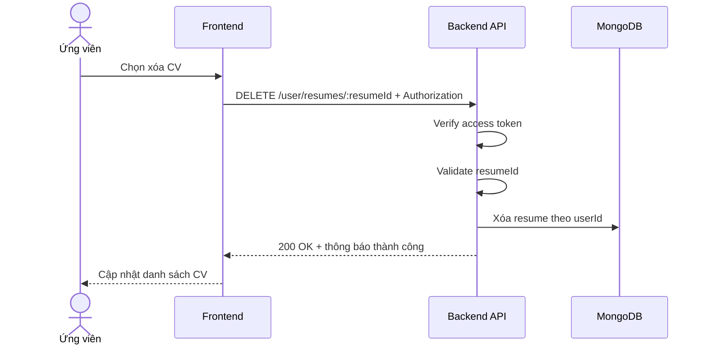

# Software Requirement Specification (SRS)
## Chức năng: Xóa CV (Delete Resume)

### Mermaid Sequence Diagram

**Mã chức năng:** RESUME-DELETE-01  
**Trạng thái:** Draft / Review  
**Người soạn thảo:** Nhữ Trung Hải  
**Vai trò:** Technical Writer / Developer

---

### 1. Mô tả tổng quan (Description)
Chức năng xóa CV cho phép người dùng gỡ một resume đã lưu khỏi tài khoản hiện tại. API hiện tại được triển khai tại `DELETE /user/resumes/:resumeId`.

### 2. Luồng nghiệp vụ (User Workflow)
| Bước | Hành động người dùng | Phản hồi hệ thống |
| :--- | :--- | :--- |
| 1 | Người dùng nhấn nút xóa CV | Frontend yêu cầu xác nhận. |
| 2 | Frontend gọi API xóa | Gửi `DELETE /user/resumes/:resumeId`. |
| 3 | Backend xác thực và kiểm tra quyền | Chỉ xóa resume thuộc user hiện tại. |
| 4 | Hoàn tất | Trả thông báo xóa thành công. |

### 3. Yêu cầu dữ liệu (Data Requirements)
#### 3.1. Dữ liệu đầu vào (Input Fields)
* **resumeId:** Mongo ObjectId hợp lệ.
* **Authorization:** bắt buộc.

#### 3.2. Dữ liệu đầu ra (Response Data)
* `status`
* `message`

#### 3.3. Dữ liệu lưu trữ / truy xuất
* Collection `resumes`

### 4. Ràng buộc kỹ thuật & bảo mật (Technical Constraints)
* Chỉ xóa dữ liệu của user hiện tại.

### 5. Trường hợp ngoại lệ & xử lý lỗi (Edge Cases)
* **Trường hợp:** Resume không tồn tại.  
  * **Xử lý:** Trả `404 Not Found`.
* **Trường hợp:** `resumeId` không hợp lệ.  
  * **Xử lý:** Trả `422 Unprocessable Entity`.

### 6. Giao diện (UI/UX)
* Cần có hộp thoại xác nhận trước khi xóa.
* Sau khi xóa thành công, danh sách CV phải refresh ngay.

---
