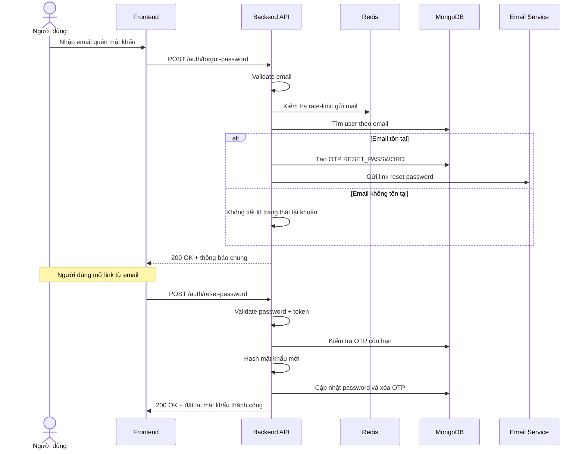

# Software Requirement Specification (SRS)
## Chức năng: Quên mật khẩu (Forgot Password)

### Mermaid Sequence Diagram

**Mã chức năng:** AUTH-FORGOT-01  
**Trạng thái:** Draft / Review  
**Người soạn thảo:** Nguyễn Trọng An  
**Vai trò:** Technical Writer / Developer

---

### 1. Mô tả tổng quan (Description)
Chức năng quên mật khẩu cho phép người dùng yêu cầu gửi email đặt lại mật khẩu khi không thể đăng nhập. Trong source hiện tại, chức năng này gồm 2 API:
* `POST /auth/forgot-password`: gửi email chứa link đặt lại mật khẩu
* `POST /auth/reset-password`: xác thực token và cập nhật mật khẩu mới

Hệ thống trả thông báo chung ở bước gửi mail để tránh lộ việc email có tồn tại trong hệ thống hay không.

### 2. Luồng nghiệp vụ (User Workflow)
| Bước | Hành động người dùng | Phản hồi hệ thống |
| :--- | :--- | :--- |
| 1 | Truy cập màn hình quên mật khẩu | Hiển thị form nhập email. |
| 2 | Nhập email và nhấn "Gửi yêu cầu" | Frontend gửi request `POST /auth/forgot-password`. |
| 3 | Hệ thống kiểm tra dữ liệu và giới hạn gửi mail | Validate email, sau đó áp dụng rate-limit gửi mail qua Redis. |
| 4 | Hệ thống kiểm tra tài khoản theo email | Nếu email tồn tại thì tạo token đặt lại mật khẩu và gửi email; nếu không tồn tại vẫn trả thông báo thành công chung. |
| 5 | Người dùng mở link từ email | Frontend hiển thị form nhập mật khẩu mới và xác nhận mật khẩu. |
| 6 | Người dùng gửi mật khẩu mới | Frontend gọi `POST /auth/reset-password` kèm `forgot_password_token`. |
| 7 | Hệ thống xác minh token và cập nhật mật khẩu | Kiểm tra token còn hạn, băm mật khẩu mới, cập nhật user và xóa OTP đã dùng. |
| 8 | Hoàn tất | Trả thông báo đặt lại mật khẩu thành công. |

### 3. Yêu cầu dữ liệu (Data Requirements)
#### 3.1. Dữ liệu đầu vào bước gửi email
* **email:** `string`, bắt buộc, đúng định dạng email, được `trim()` và chuyển về chữ thường.

#### 3.2. Dữ liệu đầu vào bước đặt lại mật khẩu
* **password:** `string`, bắt buộc, tối thiểu `8` ký tự, tối đa `50` ký tự.
* **confirmPassword:** `string`, bắt buộc, phải trùng khớp với `password`.
* **forgot_password_token:** `string`, bắt buộc.

#### 3.3. Dữ liệu đầu ra (Response Data)
* Bước gửi email:
  * `status`: `success`
  * `message`: `Đã gửi email đặt lại mật khẩu nếu email tồn tại trong hệ thống`
* Bước đặt lại mật khẩu:
  * `status`: `success`
  * `message`: `Đặt lại mật khẩu thành công`

#### 3.4. Dữ liệu lưu trữ / truy xuất
* **Collection `users`:** dùng để tra cứu user theo email và cập nhật lại trường `password`.
* **Collection `otpCodes`:** lưu token đã băm với `type = RESET_PASSWORD`, `user_id`, `expires_at`.
* **Redis rate-limit store:** lưu trạng thái giới hạn gửi mail theo tổ hợp IP và `User-Agent`.

### 4. Ràng buộc kỹ thuật & bảo mật (Technical Constraints)
* API `forgot-password` dùng `zod` để validate email.
* API `forgot-password` bị giới hạn gửi mail tối đa `3` lần trong `15 phút` trên mỗi tổ hợp IP và `User-Agent`.
* Hệ thống không trả về việc email có tồn tại hay không, nhằm hạn chế dò quét tài khoản.
* Token reset gửi qua email là token ngẫu nhiên; database chỉ lưu bản băm `sha256`.
* API `reset-password` chỉ chấp nhận token đúng loại `RESET_PASSWORD` và còn hạn sử dụng.
* Sau khi đổi mật khẩu thành công, OTP reset password bị xóa để tránh tái sử dụng.
* Mật khẩu mới được băm bằng `bcryptjs` trước khi cập nhật.

### 5. Trường hợp ngoại lệ & xử lý lỗi (Edge Cases)
* **Trường hợp:** Email sai định dạng ở bước quên mật khẩu.  
  * **Xử lý:** Trả `422 Unprocessable Entity`.
* **Trường hợp:** Gửi yêu cầu quá số lần cho phép.  
  * **Xử lý:** Trả `429 Too Many Requests`.
* **Trường hợp:** Email không tồn tại trong hệ thống.  
  * **Xử lý:** Vẫn trả `200 OK` với thông báo chung, không tiết lộ thông tin tài khoản.
* **Trường hợp:** `forgot_password_token` không hợp lệ hoặc đã hết hạn.  
  * **Xử lý:** Trả `401 Unauthorized`.
* **Trường hợp:** `confirmPassword` không khớp với `password`.  
  * **Xử lý:** Trả `422 Unprocessable Entity`.
* **Trường hợp:** Body JSON lỗi cú pháp.  
  * **Xử lý:** Trả `400 Bad Request`.
* **Trường hợp:** Lỗi gửi email hoặc lỗi cập nhật database.  
  * **Xử lý:** Trả `500 Internal Server Error`.

### 6. Giao diện (UI/UX)
* Màn hình quên mật khẩu nên có form nhập email đơn giản, rõ ràng.
* Sau khi gửi yêu cầu, frontend nên hiển thị thông báo chung thay vì báo "email không tồn tại".
* Màn hình đặt lại mật khẩu nên có 2 trường: `Password`, `Confirm password`.
* Nút gửi yêu cầu và nút đặt lại mật khẩu cần có trạng thái loading.
* Frontend nên hiển thị rõ lỗi token hết hạn hoặc không hợp lệ để người dùng yêu cầu gửi lại email mới.

---
