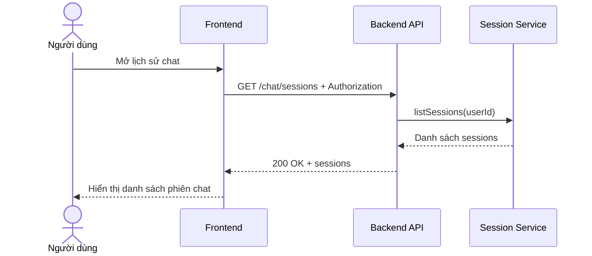

# Software Requirement Specification (SRS)
## Chức năng: Xem danh sách phiên chat (Get Chat Sessions)

### Mermaid Sequence Diagram

**Mã chức năng:** CHAT-SESSIONS-01  
**Trạng thái:** Draft / Review  
**Người soạn thảo:** Nguyễn Trọng An  
**Vai trò:** Technical Writer / Developer

---

### 1. Mô tả tổng quan (Description)
Chức năng xem danh sách phiên chat cho phép người dùng lấy toàn bộ các session chat đã có trước đó. API hiện tại được triển khai tại `GET /chat/sessions`.

### 2. Luồng nghiệp vụ (User Workflow)
| Bước | Hành động người dùng | Phản hồi hệ thống |
| :--- | :--- | :--- |
| 1 | Người dùng mở khu vực lịch sử chat | Frontend gọi API danh sách phiên. |
| 2 | Backend xác thực user | Route dùng middleware auth chung. |
| 3 | Backend gọi session service | Lấy danh sách sessions theo `userId`. |
| 4 | Hoàn tất | Trả danh sách phiên chat. |

### 3. Yêu cầu dữ liệu (Data Requirements)
#### 3.1. Dữ liệu đầu vào (Input Fields)
* **Authorization:** bắt buộc.

#### 3.2. Dữ liệu đầu ra (Response Data)
* `status`
* `data.sessions`

#### 3.3. Dữ liệu lưu trữ / truy xuất
* Dữ liệu session chat của người dùng

### 4. Ràng buộc kỹ thuật & bảo mật (Technical Constraints)
* Chỉ thấy session của chính user hiện tại.

### 5. Trường hợp ngoại lệ & xử lý lỗi (Edge Cases)
* **Trường hợp:** Chưa có session nào.  
  * **Xử lý:** Trả mảng rỗng.

### 6. Giao diện (UI/UX)
* Nên hiển thị tiêu đề phiên, thời gian cập nhật và đoạn tóm tắt cuối.

---
