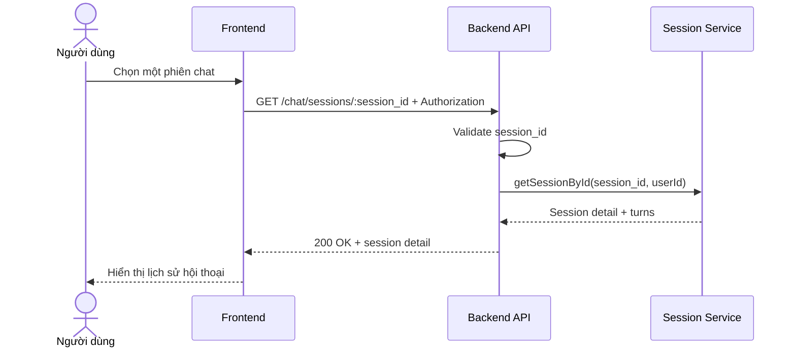

# Software Requirement Specification (SRS)
## Chức năng: Xem chi tiết một phiên chat (Get Chat Session Detail)

### Mermaid Sequence Diagram

**Mã chức năng:** CHAT-SESSION-DETAIL-01  
**Trạng thái:** Draft / Review  
**Người soạn thảo:** Nhữ Trung Hải  
**Vai trò:** Technical Writer / Developer

---

### 1. Mô tả tổng quan (Description)
Chức năng xem chi tiết phiên chat cho phép người dùng mở toàn bộ các lượt hội thoại của một session cụ thể. API hiện tại được triển khai tại `GET /chat/sessions/:session_id`.

### 2. Luồng nghiệp vụ (User Workflow)
| Bước | Hành động người dùng | Phản hồi hệ thống |
| :--- | :--- | :--- |
| 1 | Người dùng nhấn vào một session | Frontend gọi API chi tiết. |
| 2 | Backend validate `session_id` | Kiểm tra tham số đầu vào. |
| 3 | Backend lấy dữ liệu | Tải session thuộc user hiện tại. |
| 4 | Hoàn tất | Trả metadata session và danh sách turns. |

### 3. Yêu cầu dữ liệu (Data Requirements)
#### 3.1. Dữ liệu đầu vào (Input Fields)
* **Authorization:** bắt buộc.
* **session_id:** Mongo ObjectId hợp lệ.

#### 3.2. Dữ liệu đầu ra (Response Data)
* `status`
* `data.session_id`
* `data.title`
* `data.turns`
* `data.created_at`
* `data.updated_at`

#### 3.3. Dữ liệu lưu trữ / truy xuất
* Session chat và turns liên quan

### 4. Ràng buộc kỹ thuật & bảo mật (Technical Constraints)
* Chỉ được xem session của user hiện tại.

### 5. Trường hợp ngoại lệ & xử lý lỗi (Edge Cases)
* **Trường hợp:** `session_id` không hợp lệ.  
  * **Xử lý:** Trả `422 Unprocessable Entity`.
* **Trường hợp:** Session không tồn tại.  
  * **Xử lý:** Trả `404 Not Found`.

### 6. Giao diện (UI/UX)
* Giao diện nên phân biệt rõ tin nhắn user và AI.

---
