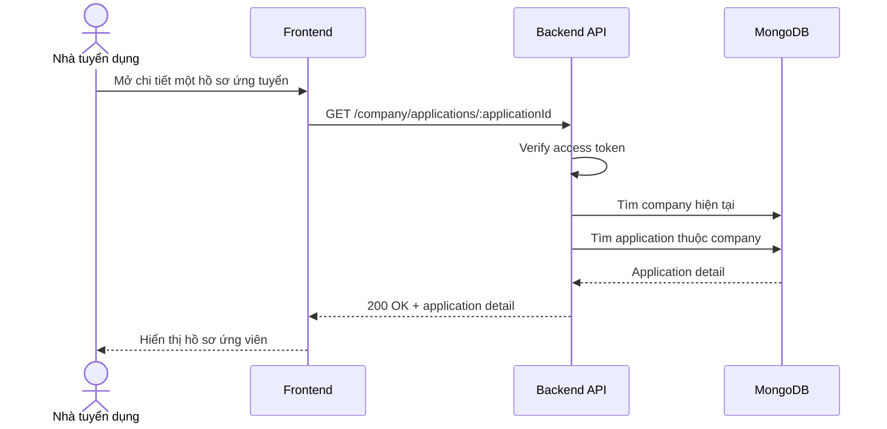

# Software Requirement Specification (SRS)
## Chức năng: Xem chi tiết hồ sơ ứng tuyển của công ty (Get Company Application Detail)

### Mermaid Sequence Diagram

**Mã chức năng:** COMPANY-APPLICATION-DETAIL-01  
**Trạng thái:** Draft / Review  
**Người soạn thảo:** Nguyễn Trọng An  
**Vai trò:** Technical Writer / Developer

---

### 1. Mô tả tổng quan (Description)
Chức năng xem chi tiết hồ sơ ứng tuyển cho phép nhà tuyển dụng mở một application cụ thể để xem resume snapshot, cover letter và trạng thái hiện tại. API hiện tại được triển khai tại `GET /company/applications/:applicationId`.

### 2. Luồng nghiệp vụ (User Workflow)
| Bước | Hành động người dùng | Phản hồi hệ thống |
| :--- | :--- | :--- |
| 1 | Người dùng nhấn xem chi tiết hồ sơ | Frontend gọi API chi tiết application. |
| 2 | Backend xác thực người dùng | Kiểm tra token và quyền admin company. |
| 3 | Backend tải application detail | Chỉ trả application thuộc company hiện tại. |
| 4 | Hoàn tất | Trả đầy đủ dữ liệu chi tiết hồ sơ. |

### 3. Yêu cầu dữ liệu (Data Requirements)
#### 3.1. Dữ liệu đầu vào (Input Fields)
* **Authorization:** bắt buộc.
* **applicationId:** Mongo ObjectId hợp lệ.

#### 3.2. Dữ liệu đầu ra (Response Data)
* `status`
* `data._id`
* `data.status`
* `data.cover_letter`
* `data.resume_snapshot`
* `data.candidate`
* `data.job`

#### 3.3. Dữ liệu lưu trữ / truy xuất
* Collection `job applications`

### 4. Ràng buộc kỹ thuật & bảo mật (Technical Constraints)
* Chỉ công ty sở hữu job mới xem được hồ sơ đó.

### 5. Trường hợp ngoại lệ & xử lý lỗi (Edge Cases)
* **Trường hợp:** `applicationId` không hợp lệ.  
  * **Xử lý:** Trả `422 Unprocessable Entity`.
* **Trường hợp:** Không tìm thấy hồ sơ thuộc company hiện tại.  
  * **Xử lý:** Trả `404 Not Found`.

### 6. Giao diện (UI/UX)
* Cần hiển thị rõ trạng thái hồ sơ, dữ liệu CV snapshot và cover letter.
* Nên có nút chuyển trạng thái trực tiếp tại màn hình chi tiết.

---
