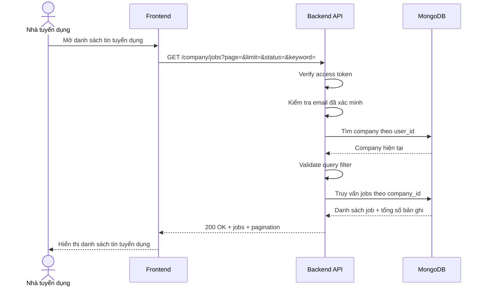

# Software Requirement Specification (SRS)
## Chức năng: Xem danh sách tin tuyển dụng của công ty (Get Company Jobs)

### Mermaid Sequence Diagram

**Mã chức năng:** JOB-LIST-01  
**Trạng thái:** Draft / Review  
**Người soạn thảo:** Phạm Nguyễn Hưng  
**Vai trò:** Technical Writer / Developer

---

### 1. Mô tả tổng quan (Description)
Chức năng xem danh sách tin tuyển dụng của công ty cho phép nhà tuyển dụng xem toàn bộ các job do công ty của mình tạo, kèm phân trang và bộ lọc theo trạng thái hoặc từ khóa tiêu đề. API hiện tại được triển khai tại `GET /company/jobs`.

### 2. Luồng nghiệp vụ (User Workflow)
| Bước | Hành động người dùng | Phản hồi hệ thống |
| :--- | :--- | :--- |
| 1 | Người dùng mở trang quản lý job | Frontend chuẩn bị query danh sách tin tuyển dụng. |
| 2 | Frontend gửi request có thể kèm phân trang hoặc bộ lọc | Backend nhận `GET /company/jobs`. |
| 3 | Hệ thống xác thực người dùng | `isAuthorized` và `isVerified` kiểm tra quyền truy cập. |
| 4 | Hệ thống kiểm tra company tồn tại | `loadCompany` và `requireCompany` xác nhận người dùng đã có hồ sơ công ty. |
| 5 | Hệ thống validate query | `getCompanyJobsValidator` kiểm tra `page`, `limit`, `status`, `keyword`. |
| 6 | Hệ thống truy vấn dữ liệu | Service lọc job theo `company_id`, trạng thái và từ khóa tiêu đề, sau đó sắp xếp `updated_at` giảm dần. |
| 7 | Hoàn tất | Trả `200 OK` cùng danh sách job và metadata phân trang. |

### 3. Yêu cầu dữ liệu (Data Requirements)
#### 3.1. Dữ liệu đầu vào (Input Fields)
* **Authorization:** `Bearer access token`, bắt buộc.
* **page:** `number`, tùy chọn, mặc định `1`, tối thiểu `1`.
* **limit:** `number`, tùy chọn, mặc định `10`, từ `1` đến `100`.
* **status:** `draft | open | paused | closed | expired`, tùy chọn.
* **keyword:** `string`, tùy chọn, tối đa `100` ký tự.

#### 3.2. Dữ liệu đầu ra (Response Data)
Khi thành công, hệ thống trả về:
* `status`: `success`
* `data.jobs`: mảng job rút gọn gồm:
  * `_id`
  * `title`
  * `location`
  * `job_type`
  * `level`
  * `status`
  * `quantity`
  * `expired_at`
  * `published_at`
  * `created_at`
  * `updated_at`
* `data.pagination.page`
* `data.pagination.limit`
* `data.pagination.total`
* `data.pagination.total_pages`

#### 3.3. Dữ liệu lưu trữ / truy xuất
* **Collection `companies`:** xác định company hiện tại.
* **Collection `jobs`:** truy vấn danh sách tin tuyển dụng theo `company_id`.

### 4. Ràng buộc kỹ thuật & bảo mật (Technical Constraints)
* API chỉ trả về các job thuộc công ty hiện tại.
* Bộ lọc `keyword` dùng regex không phân biệt hoa thường trên trường `title`.
* Danh sách mặc định được sort theo `updated_at` giảm dần.
* `status = expired` được phép lọc ở danh sách, dù route cập nhật trạng thái không cho set trực tiếp giá trị này.

### 5. Trường hợp ngoại lệ & xử lý lỗi (Edge Cases)
* **Trường hợp:** Không gửi access token hoặc email chưa xác minh.  
  * **Xử lý:** Trả `401 Unauthorized`.
* **Trường hợp:** Người dùng chưa có hồ sơ công ty.  
  * **Xử lý:** Trả `404 Not Found`.
* **Trường hợp:** `page < 1`, `limit > 100` hoặc `status` không hợp lệ.  
  * **Xử lý:** Trả `422 Unprocessable Entity`.
* **Trường hợp:** Từ khóa tìm kiếm quá dài.  
  * **Xử lý:** Trả `422 Unprocessable Entity`.
* **Trường hợp:** Lỗi hệ thống khi truy vấn danh sách.  
  * **Xử lý:** Trả `500 Internal Server Error`.

### 6. Giao diện (UI/UX)
* Frontend nên hiển thị bộ lọc theo trạng thái và ô tìm kiếm theo tiêu đề job.
* Cần có phân trang rõ ràng theo `page`, `limit`, `total_pages`.
* Trạng thái job nên hiển thị dưới dạng badge để người dùng nhận biết nhanh tin đang draft, open, paused hay closed.

---

