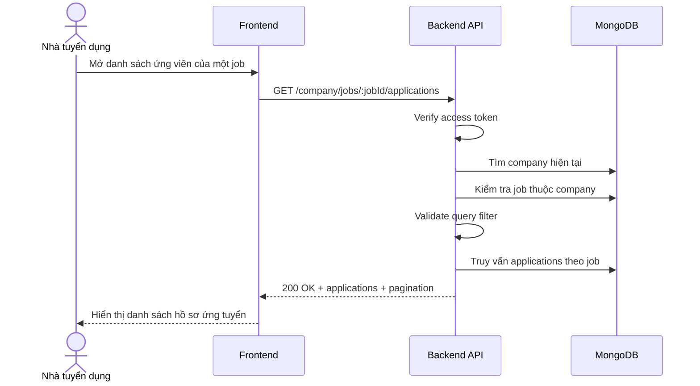

# Software Requirement Specification (SRS)
## Chức năng: Xem danh sách hồ sơ ứng tuyển theo job của công ty (Get Company Job Applications)

### Mermaid Sequence Diagram

**Mã chức năng:** COMPANY-JOB-APPLICATIONS-01  
**Trạng thái:** Draft / Review  
**Người soạn thảo:** Phạm Nguyễn Hưng  
**Vai trò:** Technical Writer / Developer

---

### 1. Mô tả tổng quan (Description)
Chức năng xem danh sách hồ sơ ứng tuyển theo job cho phép nhà tuyển dụng xem các ứng viên đã nộp vào một tin tuyển dụng thuộc công ty của mình. API hiện tại được triển khai tại `GET /company/jobs/:jobId/applications`.

### 2. Luồng nghiệp vụ (User Workflow)
| Bước | Hành động người dùng | Phản hồi hệ thống |
| :--- | :--- | :--- |
| 1 | Người dùng chọn một job trong dashboard | Frontend gọi API danh sách ứng viên. |
| 2 | Backend xác thực quyền truy cập | Kiểm tra token, company và quyền sở hữu job. |
| 3 | Backend validate query | Kiểm tra tham số lọc trạng thái, phân trang. |
| 4 | Backend truy vấn applications | Trả về danh sách hồ sơ ứng tuyển của job đó. |
| 5 | Hoàn tất | Frontend render danh sách ứng viên. |

### 3. Yêu cầu dữ liệu (Data Requirements)
#### 3.1. Dữ liệu đầu vào (Input Fields)
* **Authorization:** bắt buộc.
* **jobId:** Mongo ObjectId hợp lệ.
* Query theo `getCompanyJobApplicationsValidator`.

#### 3.2. Dữ liệu đầu ra (Response Data)
* `status`
* `data.applications`
* `data.pagination`

#### 3.3. Dữ liệu lưu trữ / truy xuất
* Collection `jobs`
* Collection `job applications`

### 4. Ràng buộc kỹ thuật & bảo mật (Technical Constraints)
* Chỉ xem được ứng viên của job thuộc company hiện tại.

### 5. Trường hợp ngoại lệ & xử lý lỗi (Edge Cases)
* **Trường hợp:** Job không thuộc company.  
  * **Xử lý:** Trả `404 Not Found` hoặc `403 Forbidden`.
* **Trường hợp:** Query không hợp lệ.  
  * **Xử lý:** Trả `422 Unprocessable Entity`.

### 6. Giao diện (UI/UX)
* Nên hỗ trợ lọc nhanh theo trạng thái hồ sơ.
* Cần có link mở chi tiết từng ứng viên.

---
