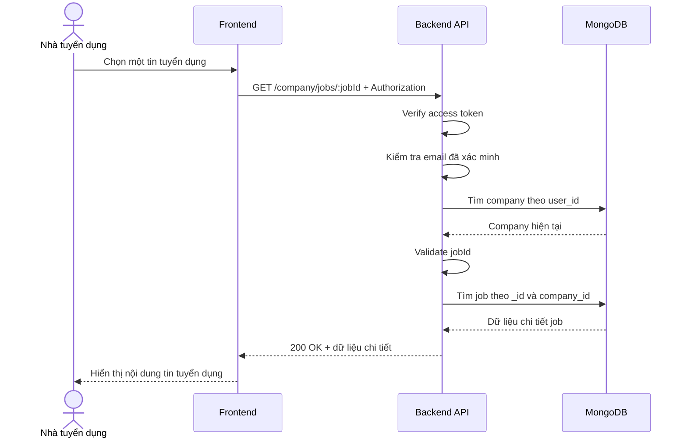

# Software Requirement Specification (SRS)
## Chức năng: Xem chi tiết tin tuyển dụng của công ty (Get Company Job Detail)

### Mermaid Sequence Diagram

**Mã chức năng:** JOB-DETAIL-01  
**Trạng thái:** Draft / Review  
**Người soạn thảo:** Nguyễn Trọng An  
**Vai trò:** Technical Writer / Developer

---

### 1. Mô tả tổng quan (Description)
Chức năng xem chi tiết tin tuyển dụng của công ty cho phép nhà tuyển dụng xem đầy đủ thông tin của một job cụ thể do chính công ty mình tạo. API hiện tại được triển khai tại `GET /company/jobs/:jobId`, và chỉ trả dữ liệu khi `jobId` thuộc về công ty hiện tại.

### 2. Luồng nghiệp vụ (User Workflow)
| Bước | Hành động người dùng | Phản hồi hệ thống |
| :--- | :--- | :--- |
| 1 | Người dùng chọn một job trong danh sách | Frontend lấy `jobId` tương ứng. |
| 2 | Frontend gửi request lấy chi tiết | Backend nhận `GET /company/jobs/:jobId`. |
| 3 | Hệ thống xác thực phiên đăng nhập | `isAuthorized` và `isVerified` kiểm tra token và email. |
| 4 | Hệ thống kiểm tra company tồn tại | `loadCompany` và `requireCompany` xác định công ty hiện tại. |
| 5 | Hệ thống validate `jobId` | `getCompanyJobDetailValidator` kiểm tra ObjectId MongoDB hợp lệ. |
| 6 | Hệ thống truy vấn job | Tìm job theo `_id` và `company_id`. |
| 7 | Hoàn tất | Trả `200 OK` cùng toàn bộ thông tin chi tiết của job. |

### 3. Yêu cầu dữ liệu (Data Requirements)
#### 3.1. Dữ liệu đầu vào (Input Fields)
* **Authorization:** `Bearer access token`, bắt buộc.
* **jobId:** `string`, bắt buộc, phải là ObjectId MongoDB hợp lệ gồm `24` ký tự hex.

#### 3.2. Dữ liệu đầu ra (Response Data)
Khi thành công, hệ thống trả về:
* `status`: `success`
* `data._id`
* `data.title`
* `data.description`
* `data.requirements`
* `data.benefits`
* `data.salary`
* `data.location`
* `data.job_type`
* `data.level`
* `data.status`
* `data.category`
* `data.skills`
* `data.quantity`
* `data.expired_at`
* `data.published_at`
* `data.created_at`
* `data.updated_at`

#### 3.3. Dữ liệu lưu trữ / truy xuất
* **Collection `companies`:** xác định company hiện tại của người dùng.
* **Collection `jobs`:** truy xuất job chi tiết theo `_id` và `company_id`.

### 4. Ràng buộc kỹ thuật & bảo mật (Technical Constraints)
* API chỉ cho phép xem chi tiết job thuộc công ty hiện tại.
* `jobId` được validate trước khi truy vấn database để tránh lỗi convert ObjectId.
* Controller không trả `company_id`, chỉ trả các trường nghiệp vụ của job.

### 5. Trường hợp ngoại lệ & xử lý lỗi (Edge Cases)
* **Trường hợp:** Không gửi access token hoặc email chưa xác minh.  
  * **Xử lý:** Trả `401 Unauthorized`.
* **Trường hợp:** Người dùng chưa có hồ sơ công ty.  
  * **Xử lý:** Trả `404 Not Found`.
* **Trường hợp:** `jobId` không đúng định dạng MongoDB ObjectId.  
  * **Xử lý:** Trả `422 Unprocessable Entity`.
* **Trường hợp:** Không tìm thấy job hoặc job không thuộc công ty hiện tại.  
  * **Xử lý:** Trả `404 Not Found` với thông báo `JOB_NOT_FOUND`.
* **Trường hợp:** Lỗi hệ thống khi truy vấn database.  
  * **Xử lý:** Trả `500 Internal Server Error`.

### 6. Giao diện (UI/UX)
* Frontend nên gọi API này khi người dùng mở trang chi tiết job hoặc màn hình chỉnh sửa.
* Nếu job không tồn tại, giao diện nên hiển thị trạng thái lỗi rõ ràng và quay về danh sách job.
* Dữ liệu trả về đủ để hiển thị cả màn hình xem và prefill cho form chỉnh sửa.

---

