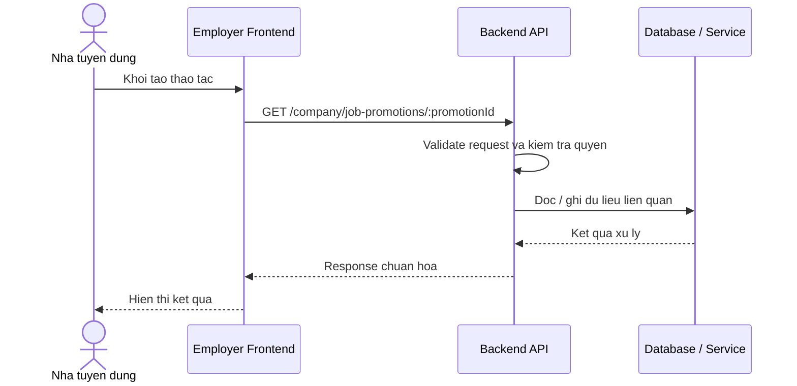

# Software Requirement Specification (SRS)
## Chuc nang: Xem chi tiet chien dich quang ba job cua cong ty

### Mermaid Sequence Diagram

**Ma chuc nang:** COMPANY-JOB-PROMOTION-DETAIL-01  
**Trang thai:** Draft / Review  
**Nguoi soan thao:** Nhu Trung Hai  
**Vai tro:** Technical Writer / Developer

---

### 1. Mo ta tong quan (Description)
Chuc nang tra ve thong tin chi tiet cua mot promotion cu the ma cong ty dang quan ly. API hien tai duoc trien khai tai `GET /company/job-promotions/:promotionId`.

### 2. Luong nghiep vu (User Workflow)
| Buoc | Hanh dong nguoi dung | Phan hoi he thong |
| :--- | :--- | :--- |
| 1 | Nguoi dung / quan tri vien mo chuc nang tuong ung | Frontend chuan bi du lieu va goi API. |
| 2 | Frontend gui request den backend | Backend kiem tra du lieu dau vao, token, quyen va ngu canh nghiep vu. |
| 3 | Backend xu ly nghiep vu | He thong doc / ghi du lieu tai MongoDB hoac dich vu phu tro. |
| 4 | Hoan tat | Backend tra response dang `status`, `message`, `data` de frontend cap nhat giao dien. |

### 3. Yeu cau du lieu (Data Requirements)
#### 3.1. Du lieu dau vao (Input Fields)
* Cong ty da dang nhap va xac minh.
* Path param `promotionId` hop le.

#### 3.2. Du lieu dau ra (Response Data)
* Chi tiet promotion, job lien quan, muc uu tien, thoi gian chay, trang thai.

#### 3.3. Du lieu luu tru / truy xuat
* Collection `job_promotions` cung du lieu job lien quan.

### 4. Rang buoc ky thuat & bao mat (Technical Constraints)
* Promotion phai thuoc ve cong ty hien tai.
* Path param can duoc validate truoc khi truy van DB.

### 5. Truong hop ngoai le & xu ly loi (Edge Cases)
* **Truong hop:** Khong tim thay promotion.  
  * **Xu ly:** Tra `404 Not Found`.
* **Truong hop:** Promotion khong thuoc cong ty hien tai.  
  * **Xu ly:** Tra loi phan quyen.

### 6. Giao dien (UI/UX)
* Trang chi tiet nen hien thi timeline hieu luc va trang thai thanh toan.
* Nen co hanh dong huy neu promotion con cho phep.

---
