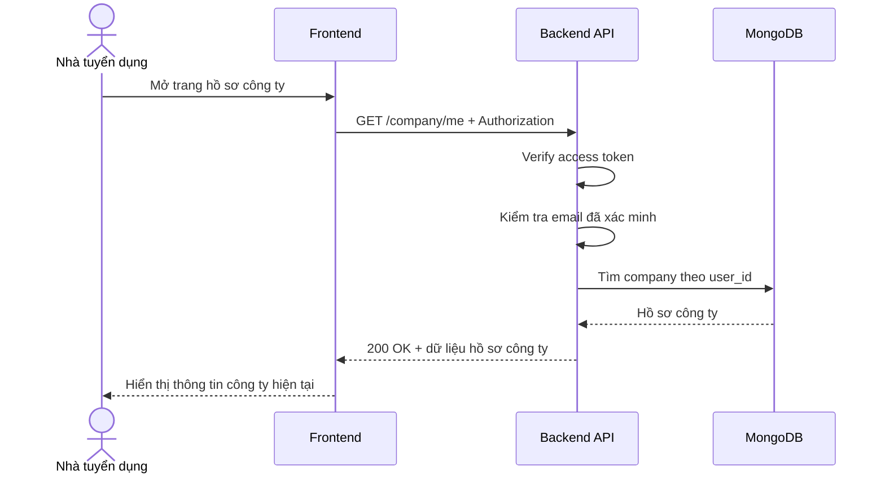

# Software Requirement Specification (SRS)
## Chức năng: Xem hồ sơ công ty của tôi (Get Company Me)

### Mermaid Sequence Diagram

**Mã chức năng:** COMPANY-ME-01  
**Trạng thái:** Draft / Review  
**Người soạn thảo:** Phạm Nguyễn Hưng  
**Vai trò:** Technical Writer / Developer

---

### 1. Mô tả tổng quan (Description)
Chức năng xem hồ sơ công ty của tôi cho phép người dùng đã đăng nhập, đã xác minh email và đã tạo hồ sơ công ty xem nhanh thông tin doanh nghiệp hiện tại của mình. API hiện tại được triển khai tại `GET /company/me`, trả về tập trường dữ liệu cần thiết để hiển thị dashboard công ty.

### 2. Luồng nghiệp vụ (User Workflow)
| Bước | Hành động người dùng | Phản hồi hệ thống |
| :--- | :--- | :--- |
| 1 | Người dùng truy cập trang hồ sơ công ty | Frontend chuẩn bị gọi API lấy hồ sơ công ty hiện tại. |
| 2 | Frontend gửi request kèm access token | Backend nhận `GET /company/me`. |
| 3 | Hệ thống xác thực phiên đăng nhập | Middleware `isAuthorized` kiểm tra access token. |
| 4 | Hệ thống kiểm tra email đã xác minh | Middleware `isVerified` kiểm tra cờ `vfd` trong token. |
| 5 | Hệ thống tải hồ sơ công ty | Middleware `loadCompany` truy vấn company theo `user_id`. |
| 6 | Hệ thống xác nhận company tồn tại | Middleware `requireCompany` đảm bảo người dùng đã có hồ sơ công ty. |
| 7 | Hoàn tất | Trả `200 OK` cùng dữ liệu hồ sơ công ty để frontend hiển thị. |

### 3. Yêu cầu dữ liệu (Data Requirements)
#### 3.1. Dữ liệu đầu vào (Input Fields)
* **Authorization:** `Bearer access token`, bắt buộc.

#### 3.2. Dữ liệu đầu ra (Response Data)
Khi thành công, hệ thống trả về:
* `status`: `success`
* `data.company_name`
* `data.logo`
* `data.website`
* `data.address`
* `data.description`
* `data.verified`
* `data.created_at`
* `data.updated_at`

#### 3.3. Dữ liệu lưu trữ / truy xuất
* **JWT Access Token:** lấy `userId` và trạng thái xác minh email.
* **Collection `companies`:** truy vấn hồ sơ công ty theo `user_id`.

### 4. Ràng buộc kỹ thuật & bảo mật (Technical Constraints)
* Route nằm dưới `/company`, nên mặc định yêu cầu đăng nhập và email đã xác minh.
* API không nhận body hay query parameter.
* Controller chỉ trả về các trường được `pick`, không trả toàn bộ document công ty.
* Người dùng chưa tạo company sẽ bị chặn trước khi vào controller.

### 5. Trường hợp ngoại lệ & xử lý lỗi (Edge Cases)
* **Trường hợp:** Không gửi access token.  
  * **Xử lý:** Trả `401 Unauthorized`.
* **Trường hợp:** Email chưa xác minh.  
  * **Xử lý:** Trả `401 Unauthorized`.
* **Trường hợp:** Người dùng chưa tạo hồ sơ công ty.  
  * **Xử lý:** Trả `404 Not Found` với thông báo `COMPANY_PROFILE_NOT_FOUND`.
* **Trường hợp:** Lỗi hệ thống khi truy vấn database.  
  * **Xử lý:** Trả `500 Internal Server Error`.

### 6. Giao diện (UI/UX)
* Frontend nên gọi API này khi người dùng mở dashboard hoặc trang hồ sơ công ty.
* Nếu API trả `404`, giao diện nên điều hướng người dùng sang luồng tạo hồ sơ công ty.
* Có thể hiển thị trạng thái `verified` để giải thích vì sao một số chức năng tuyển dụng chưa dùng được.

---

