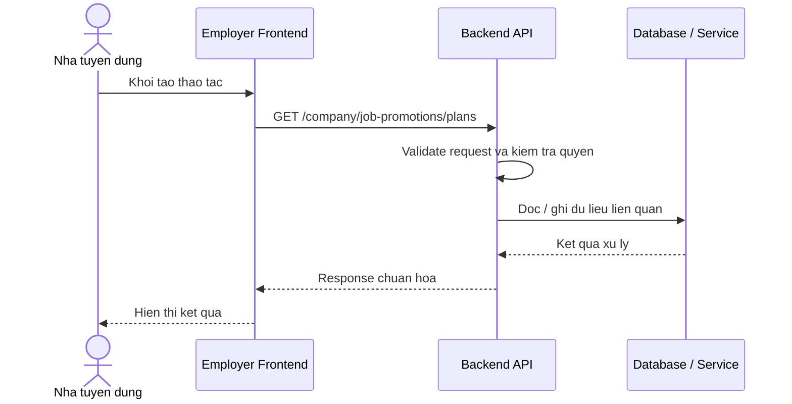

# Software Requirement Specification (SRS)
## Chuc nang: Xem danh sach goi quang ba tin tuyen dung

### Mermaid Sequence Diagram

**Ma chuc nang:** COMPANY-PROMOTION-PLANS-01  
**Trang thai:** Draft / Review  
**Nguoi soan thao:** Nhu Trung Hai  
**Vai tro:** Technical Writer / Developer

---

### 1. Mo ta tong quan (Description)
Chuc nang cho phep cong ty xem cac goi quang ba job hien he thong ho tro truoc khi mua promotion. API hien tai duoc trien khai tai `GET /company/job-promotions/plans`.

### 2. Luong nghiep vu (User Workflow)
| Buoc | Hanh dong nguoi dung | Phan hoi he thong |
| :--- | :--- | :--- |
| 1 | Nguoi dung / quan tri vien mo chuc nang tuong ung | Frontend chuan bi du lieu va goi API. |
| 2 | Frontend gui request den backend | Backend kiem tra du lieu dau vao, token, quyen va ngu canh nghiep vu. |
| 3 | Backend xu ly nghiep vu | He thong doc / ghi du lieu tai MongoDB hoac dich vu phu tro. |
| 4 | Hoan tat | Backend tra response dang `status`, `message`, `data` de frontend cap nhat giao dien. |

### 3. Yeu cau du lieu (Data Requirements)
#### 3.1. Du lieu dau vao (Input Fields)
* Cong ty phai dang nhap va da duoc xac minh.
* Khong yeu cau body.

#### 3.2. Du lieu dau ra (Response Data)
* Danh sach promotion plan / policy ma cong ty co the mua.

#### 3.3. Du lieu luu tru / truy xuat
* Cau hinh ke hoach quang ba trong service nghiep vu va du lieu khuyen mai lien quan.

### 4. Rang buoc ky thuat & bao mat (Technical Constraints)
* Chi cong ty da xac minh moi truy cap duoc.
* Danh sach goi phai phan anh dung cau hinh hien hanh cua he thong.

### 5. Truong hop ngoai le & xu ly loi (Edge Cases)
* **Truong hop:** Cong ty chua xac minh.  
  * **Xu ly:** Tra loi khong du dieu kien thao tac.
* **Truong hop:** Chua cau hinh plan.  
  * **Xu ly:** Tra danh sach rong.

### 6. Giao dien (UI/UX)
* Trang promotion can hien thi ro gia, thoi luong, muc uu tien.
* Nen co CTA mua goi ngay tu danh sach.

---
