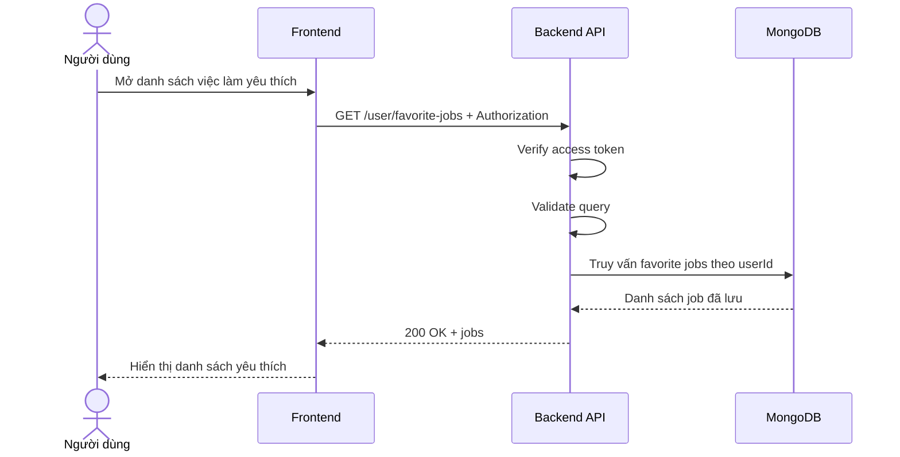

# Software Requirement Specification (SRS)
## Chức năng: Xem danh sách việc làm yêu thích (Get Favorite Jobs)

### Mermaid Sequence Diagram

**Mã chức năng:** FAVORITE-LIST-01  
**Trạng thái:** Draft / Review  
**Người soạn thảo:** Phạm Nguyễn Hưng  
**Vai trò:** Technical Writer / Developer

---

### 1. Mô tả tổng quan (Description)
Chức năng xem danh sách việc làm yêu thích cho phép người dùng lấy các job đã lưu trước đó. API hiện tại được triển khai tại `GET /user/favorite-jobs`.

### 2. Luồng nghiệp vụ (User Workflow)
| Bước | Hành động người dùng | Phản hồi hệ thống |
| :--- | :--- | :--- |
| 1 | Mở trang việc làm yêu thích | Frontend gọi API lấy danh sách đã lưu. |
| 2 | Backend xác thực người dùng | Kiểm tra token và query. |
| 3 | Backend truy vấn dữ liệu | Lấy các favorite jobs của user. |
| 4 | Hoàn tất | Trả danh sách để hiển thị. |

### 3. Yêu cầu dữ liệu (Data Requirements)
#### 3.1. Dữ liệu đầu vào (Input Fields)
* **Authorization:** bắt buộc.
* Query theo validator `getFavoriteJobsValidator`.

#### 3.2. Dữ liệu đầu ra (Response Data)
* `status`
* `data.jobs` hoặc `data.items`

#### 3.3. Dữ liệu lưu trữ / truy xuất
* Dữ liệu favorite jobs gắn với `userId`.

### 4. Ràng buộc kỹ thuật & bảo mật (Technical Constraints)
* Chỉ trả về danh sách của user hiện tại.

### 5. Trường hợp ngoại lệ & xử lý lỗi (Edge Cases)
* **Trường hợp:** Không đăng nhập.  
  * **Xử lý:** Trả `401 Unauthorized`.
* **Trường hợp:** Chưa lưu job nào.  
  * **Xử lý:** Trả danh sách rỗng.

### 6. Giao diện (UI/UX)
* Nên cho phép bỏ lưu ngay từ danh sách yêu thích.

---
