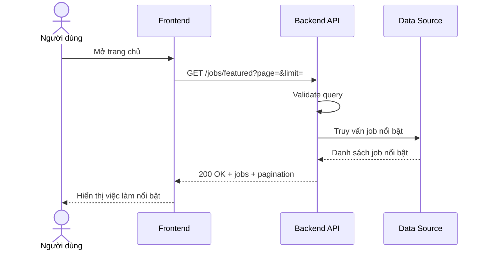

# Software Requirement Specification (SRS)
## Chức năng: Xem danh sách việc làm nổi bật (Get Featured Jobs)

### Mermaid Sequence Diagram

**Mã chức năng:** JOB-FEATURED-01  
**Trạng thái:** Draft / Review  
**Người soạn thảo:** Phạm Nguyễn Hưng  
**Vai trò:** Technical Writer / Developer

---

### 1. Mô tả tổng quan (Description)
Chức năng xem việc làm nổi bật cho phép trang chủ hoặc landing page lấy danh sách job được ưu tiên hiển thị. API hiện tại được triển khai tại `GET /jobs/featured`.

### 2. Luồng nghiệp vụ (User Workflow)
| Bước | Hành động người dùng | Phản hồi hệ thống |
| :--- | :--- | :--- |
| 1 | Người dùng mở trang chủ | Frontend chuẩn bị tải block việc làm nổi bật. |
| 2 | Frontend gửi request | Gọi `GET /jobs/featured`. |
| 3 | Hệ thống validate query | Kiểm tra `page` và `limit`. |
| 4 | Hệ thống truy vấn job nổi bật | Trả về danh sách phù hợp để hiển thị. |
| 5 | Hoàn tất | Frontend render block featured jobs. |

### 3. Yêu cầu dữ liệu (Data Requirements)
#### 3.1. Dữ liệu đầu vào (Input Fields)
* **page:** `number`, tùy chọn.
* **limit:** `number`, tùy chọn.

#### 3.2. Dữ liệu đầu ra (Response Data)
* `status`: `success`
* `data.items` hoặc `data.jobs`
* `data.pagination`

#### 3.3. Dữ liệu lưu trữ / truy xuất
* Dữ liệu job public đủ điều kiện hiển thị nổi bật.

### 4. Ràng buộc kỹ thuật & bảo mật (Technical Constraints)
* API không yêu cầu đăng nhập.
* Dữ liệu phải qua validator query trước khi trả về.

### 5. Trường hợp ngoại lệ & xử lý lỗi (Edge Cases)
* **Trường hợp:** `page`, `limit` không hợp lệ.  
  * **Xử lý:** Trả `422 Unprocessable Entity`.
* **Trường hợp:** Không có dữ liệu nổi bật.  
  * **Xử lý:** Trả danh sách rỗng.

### 6. Giao diện (UI/UX)
* Khối featured jobs nên đặt ở đầu trang chủ.
* Nên có nút “Xem thêm” nếu có phân trang.

---
