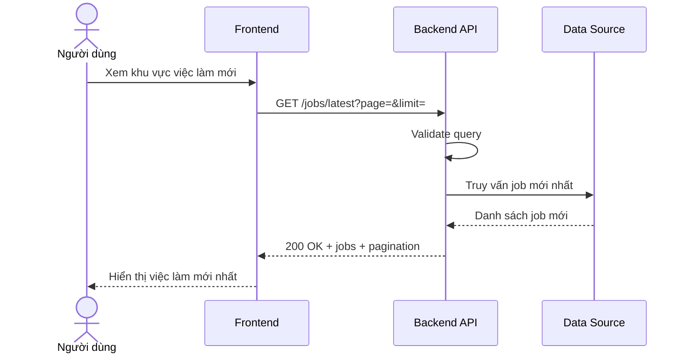

# Software Requirement Specification (SRS)
## Chức năng: Xem danh sách việc làm mới nhất (Get Latest Jobs)

### Mermaid Sequence Diagram

**Mã chức năng:** JOB-LATEST-01  
**Trạng thái:** Draft / Review  
**Người soạn thảo:** Nguyễn Trọng An  
**Vai trò:** Technical Writer / Developer

---

### 1. Mô tả tổng quan (Description)
Chức năng xem việc làm mới nhất cho phép frontend lấy các tin tuyển dụng public mới được cập nhật gần đây nhất. API hiện tại được triển khai tại `GET /jobs/latest`.

### 2. Luồng nghiệp vụ (User Workflow)
| Bước | Hành động người dùng | Phản hồi hệ thống |
| :--- | :--- | :--- |
| 1 | Người dùng mở trang có block việc làm mới | Frontend gọi API lấy danh sách mới nhất. |
| 2 | Backend nhận request | Validate `page` và `limit`. |
| 3 | Backend truy vấn dữ liệu | Sắp xếp theo thời gian phù hợp. |
| 4 | Hoàn tất | Trả `200 OK` cùng danh sách job. |

### 3. Yêu cầu dữ liệu (Data Requirements)
#### 3.1. Dữ liệu đầu vào (Input Fields)
* **page:** `number`, tùy chọn.
* **limit:** `number`, tùy chọn.

#### 3.2. Dữ liệu đầu ra (Response Data)
* `status`: `success`
* `data.items` hoặc `data.jobs`
* `data.pagination`

#### 3.3. Dữ liệu lưu trữ / truy xuất
* Job public còn hiệu lực và được phép hiển thị.

### 4. Ràng buộc kỹ thuật & bảo mật (Technical Constraints)
* API public, không yêu cầu token.
* Query phải đi qua validator trước khi xử lý.

### 5. Trường hợp ngoại lệ & xử lý lỗi (Edge Cases)
* **Trường hợp:** Query không hợp lệ.  
  * **Xử lý:** Trả `422 Unprocessable Entity`.
* **Trường hợp:** Không có job mới.  
  * **Xử lý:** Trả danh sách rỗng.

### 6. Giao diện (UI/UX)
* Block việc làm mới nên hiển thị rõ thời gian đăng.
* Có thể tải thêm nếu còn trang tiếp theo.

---
