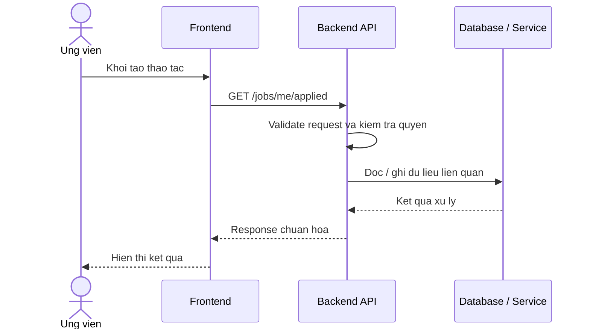

# Software Requirement Specification (SRS)
## Chuc nang: Xem danh sach viec lam da ung tuyen

### Mermaid Sequence Diagram

**Ma chuc nang:** JOB-APPLIED-LIST-01  
**Trang thai:** Draft / Review  
**Nguoi soan thao:** Nhu Trung Hai  
**Vai tro:** Technical Writer / Developer

---

### 1. Mo ta tong quan (Description)
Chuc nang cho phep ung vien xem danh sach cac tin tuyen dung ma minh da ung tuyen kem trang thai ho so. API hien tai duoc trien khai tai `GET /jobs/me/applied`.

### 2. Luong nghiep vu (User Workflow)
| Buoc | Hanh dong nguoi dung | Phan hoi he thong |
| :--- | :--- | :--- |
| 1 | Nguoi dung / quan tri vien mo chuc nang tuong ung | Frontend chuan bi du lieu va goi API. |
| 2 | Frontend gui request den backend | Backend kiem tra du lieu dau vao, token, quyen va ngu canh nghiep vu. |
| 3 | Backend xu ly nghiep vu | He thong doc / ghi du lieu tai MongoDB hoac dich vu phu tro. |
| 4 | Hoan tat | Backend tra response dang `status`, `message`, `data` de frontend cap nhat giao dien. |

### 3. Yeu cau du lieu (Data Requirements)
#### 3.1. Du lieu dau vao (Input Fields)
* Header `Authorization` hop le.
* Query filter / phan trang theo validator `getMyAppliedJobsValidator`.

#### 3.2. Du lieu dau ra (Response Data)
* Danh sach job application cua chinh nguoi dung.
* Thong tin phan trang va trang thai ho so.

#### 3.3. Du lieu luu tru / truy xuat
* Collection `job_applications` de lay danh sach ho so ung tuyen.
* Collection `jobs` de lay thong tin job lien quan.

### 4. Rang buoc ky thuat & bao mat (Technical Constraints)
* Chi nguoi dung da dang nhap moi xem duoc danh sach cua minh.
* Danh sach phai duoc loc theo `candidate_id` hien tai.

### 5. Truong hop ngoai le & xu ly loi (Edge Cases)
* **Truong hop:** Khong co du lieu ung tuyen.  
  * **Xu ly:** Tra danh sach rong cung `200 OK`.
* **Truong hop:** Query phan trang khong hop le.  
  * **Xu ly:** Tra `422 Unprocessable Entity`.

### 6. Giao dien (UI/UX)
* Trang "Da ung tuyen" nen ho tro loc theo trang thai va phan trang.
* Nen hien thi trang thai ho so ro rang tren tung item.

---
