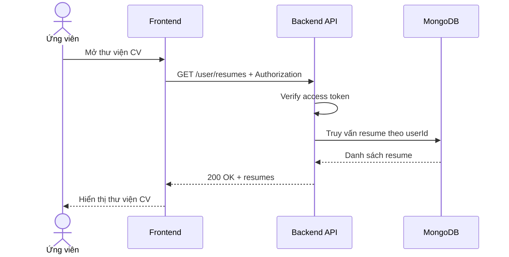

# Software Requirement Specification (SRS)
## Chức năng: Xem danh sách CV của tôi (Get My Resumes)

### Mermaid Sequence Diagram

**Mã chức năng:** RESUME-LIST-01  
**Trạng thái:** Draft / Review  
**Người soạn thảo:** Phạm Nguyễn Hưng  
**Vai trò:** Technical Writer / Developer

---

### 1. Mô tả tổng quan (Description)
Chức năng xem danh sách CV của tôi cho phép ứng viên lấy toàn bộ các CV đã lưu trong tài khoản hiện tại. API hiện tại được triển khai tại `GET /user/resumes`.

### 2. Luồng nghiệp vụ (User Workflow)
| Bước | Hành động người dùng | Phản hồi hệ thống |
| :--- | :--- | :--- |
| 1 | Người dùng mở thư viện CV | Frontend gọi API danh sách. |
| 2 | Backend xác thực người dùng | Kiểm tra token. |
| 3 | Backend truy vấn dữ liệu | Lấy tất cả resume theo `userId`. |
| 4 | Hoàn tất | Trả danh sách resume để render. |

### 3. Yêu cầu dữ liệu (Data Requirements)
#### 3.1. Dữ liệu đầu vào (Input Fields)
* **Authorization:** bắt buộc.

#### 3.2. Dữ liệu đầu ra (Response Data)
* `status`
* `data[]`: danh sách resume của user

#### 3.3. Dữ liệu lưu trữ / truy xuất
* Collection `resumes`

### 4. Ràng buộc kỹ thuật & bảo mật (Technical Constraints)
* Chỉ trả CV của tài khoản hiện tại.

### 5. Trường hợp ngoại lệ & xử lý lỗi (Edge Cases)
* **Trường hợp:** Không đăng nhập.  
  * **Xử lý:** Trả `401 Unauthorized`.
* **Trường hợp:** Chưa có CV nào.  
  * **Xử lý:** Trả mảng rỗng.

### 6. Giao diện (UI/UX)
* Nên hiển thị rõ CV mặc định, ngày tạo và nút xem/xóa.

---
