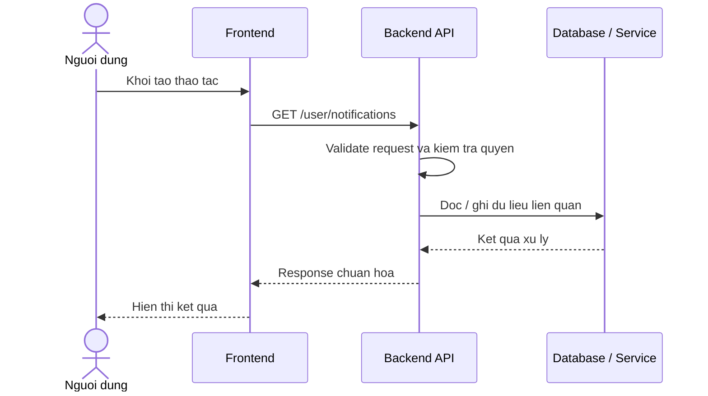

# Software Requirement Specification (SRS)
## Chuc nang: Xem danh sach thong bao

### Mermaid Sequence Diagram

**Ma chuc nang:** NOTIFICATION-LIST-01  
**Trang thai:** Draft / Review  
**Nguoi soan thao:** Nhu Trung Hai  
**Vai tro:** Technical Writer / Developer

---

### 1. Mo ta tong quan (Description)
Chuc nang cho phep nguoi dung xem cac thong bao nghiep vu da phat sinh trong he thong. API hien tai duoc trien khai tai `GET /user/notifications`.

### 2. Luong nghiep vu (User Workflow)
| Buoc | Hanh dong nguoi dung | Phan hoi he thong |
| :--- | :--- | :--- |
| 1 | Nguoi dung / quan tri vien mo chuc nang tuong ung | Frontend chuan bi du lieu va goi API. |
| 2 | Frontend gui request den backend | Backend kiem tra du lieu dau vao, token, quyen va ngu canh nghiep vu. |
| 3 | Backend xu ly nghiep vu | He thong doc / ghi du lieu tai MongoDB hoac dich vu phu tro. |
| 4 | Hoan tat | Backend tra response dang `status`, `message`, `data` de frontend cap nhat giao dien. |

### 3. Yeu cau du lieu (Data Requirements)
#### 3.1. Du lieu dau vao (Input Fields)
* Header `Authorization` hop le.
* Query phan trang / bo loc theo validator `getNotificationsValidator`.

#### 3.2. Du lieu dau ra (Response Data)
* Danh sach thong bao cua nguoi dung.
* Thong tin unread / read va metadata phan trang.

#### 3.3. Du lieu luu tru / truy xuat
* Collection `notifications` de truy van danh sach thong bao cua user.

### 4. Rang buoc ky thuat & bao mat (Technical Constraints)
* Chi tra ve thong bao cua chinh user dang dang nhap.
* Thong bao phai duoc sap xep theo thoi gian moi nhat truoc.

### 5. Truong hop ngoai le & xu ly loi (Edge Cases)
* **Truong hop:** Khong co thong bao.  
  * **Xu ly:** Tra danh sach rong.
* **Truong hop:** Token khong hop le.  
  * **Xu ly:** Tra `401 Unauthorized`.

### 6. Giao dien (UI/UX)
* Notification center nen co badge read/unread.
* Danh sach nen ho tro phan trang hoac infinite scroll.

---
