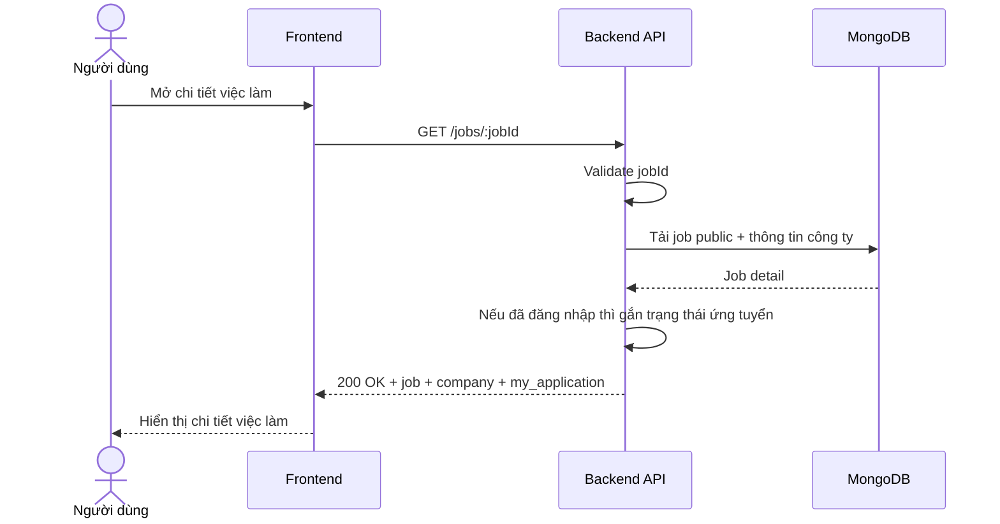

# Software Requirement Specification (SRS)
## Chức năng: Xem chi tiết việc làm công khai (Get Public Job Detail)

### Mermaid Sequence Diagram

**Mã chức năng:** JOB-PUBLIC-DETAIL-01  
**Trạng thái:** Draft / Review  
**Người soạn thảo:** Nhữ Trung Hải  
**Vai trò:** Technical Writer / Developer

---

### 1. Mô tả tổng quan (Description)
Chức năng xem chi tiết việc làm công khai cho phép người dùng xem đầy đủ nội dung của một tin tuyển dụng public, đồng thời nếu đã đăng nhập thì backend có thể gắn thêm trạng thái hồ sơ ứng tuyển hiện tại. API hiện tại được triển khai tại `GET /jobs/:jobId`.

### 2. Luồng nghiệp vụ (User Workflow)
| Bước | Hành động người dùng | Phản hồi hệ thống |
| :--- | :--- | :--- |
| 1 | Người dùng nhấn vào một job | Frontend chuyển sang trang chi tiết. |
| 2 | Frontend gọi `GET /jobs/:jobId` | Backend validate tham số. |
| 3 | Backend tải job detail | Kiểm tra job public và dữ liệu công ty liên quan. |
| 4 | Nếu người dùng đã đăng nhập | Hệ thống gắn thêm `my_application` nếu có. |
| 5 | Hoàn tất | Trả về thông tin chi tiết để hiển thị. |

### 3. Yêu cầu dữ liệu (Data Requirements)
#### 3.1. Dữ liệu đầu vào (Input Fields)
* **jobId:** Mongo ObjectId hợp lệ.
* **Authorization:** tùy chọn, được decode mềm bằng middleware optional.

#### 3.2. Dữ liệu đầu ra (Response Data)
* `status`: `success`
* `data.job`
* `data.company`
* `data.my_application` nếu người dùng đã từng ứng tuyển

#### 3.3. Dữ liệu lưu trữ / truy xuất
* Collection `jobs`
* Collection `companies`
* Dữ liệu application của người dùng đăng nhập (nếu có)

### 4. Ràng buộc kỹ thuật & bảo mật (Technical Constraints)
* Route dùng `optionalDecodeToken`, không bắt buộc đăng nhập.
* Chỉ job public hợp lệ mới được hiển thị.

### 5. Trường hợp ngoại lệ & xử lý lỗi (Edge Cases)
* **Trường hợp:** `jobId` sai định dạng.  
  * **Xử lý:** Trả `422 Unprocessable Entity`.
* **Trường hợp:** Job không tồn tại hoặc không public.  
  * **Xử lý:** Trả `404 Not Found`.

### 6. Giao diện (UI/UX)
* Trang chi tiết nên hiển thị rõ mô tả, yêu cầu, quyền lợi, công ty và trạng thái ứng tuyển.
* Nếu đã nộp hồ sơ thì nên hiện badge trạng thái.

---
