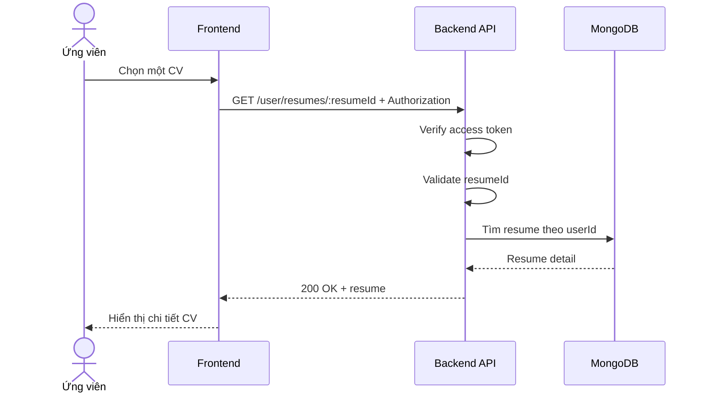

# Software Requirement Specification (SRS)
## Chức năng: Xem chi tiết CV (Get Resume Detail)

### Mermaid Sequence Diagram

**Mã chức năng:** RESUME-DETAIL-01  
**Trạng thái:** Draft / Review  
**Người soạn thảo:** Nguyễn Trọng An  
**Vai trò:** Technical Writer / Developer

---

### 1. Mô tả tổng quan (Description)
Chức năng xem chi tiết CV cho phép người dùng lấy một resume cụ thể thuộc tài khoản hiện tại. API hiện tại được triển khai tại `GET /user/resumes/:resumeId`.

### 2. Luồng nghiệp vụ (User Workflow)
| Bước | Hành động người dùng | Phản hồi hệ thống |
| :--- | :--- | :--- |
| 1 | Người dùng chọn CV cần xem | Frontend gọi API chi tiết. |
| 2 | Backend validate `resumeId` | Kiểm tra định dạng ID. |
| 3 | Backend kiểm tra quyền sở hữu | Chỉ trả resume thuộc user hiện tại. |
| 4 | Hoàn tất | Trả dữ liệu chi tiết CV. |

### 3. Yêu cầu dữ liệu (Data Requirements)
#### 3.1. Dữ liệu đầu vào (Input Fields)
* **resumeId:** Mongo ObjectId hợp lệ.
* **Authorization:** bắt buộc.

#### 3.2. Dữ liệu đầu ra (Response Data)
* `status`
* `data`: thông tin chi tiết resume

#### 3.3. Dữ liệu lưu trữ / truy xuất
* Collection `resumes`

### 4. Ràng buộc kỹ thuật & bảo mật (Technical Constraints)
* Không cho xem resume của tài khoản khác.

### 5. Trường hợp ngoại lệ & xử lý lỗi (Edge Cases)
* **Trường hợp:** `resumeId` sai định dạng.  
  * **Xử lý:** Trả `422 Unprocessable Entity`.
* **Trường hợp:** Không tìm thấy resume.  
  * **Xử lý:** Trả `404 Not Found`.

### 6. Giao diện (UI/UX)
* Frontend nên mở được preview CV hoặc liên kết file gốc.

---
